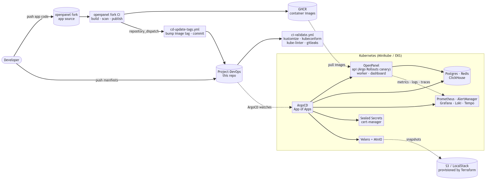

# Project-DevOps (GitOps)

Infraestructura DevOps end-to-end para **OpenPanel** (analítica web open-source): Docker Compose en local, Kubernetes con GitOps en cluster, Terraform para la nube.

El proyecto incluye:

- **Docker Compose** para desarrollo y pruebas en local
- **Terraform** para el aprovisionamiento en cloud (almacenamiento de backups, IAM)
- **Minikube** en local, **EKS** en el diseño de AWS
- **ArgoCD** para la gestión de despliegues mediante GitOps
- **Argo Rollouts** para entregas blue-green en la API
- **Prometheus, Alertmanager, Grafana, Loki, Promtail, Tempo** para métricas, logs, trazas y dashboards
- **Velero + MinIO** para backups del clúster (S3 en el diseño de AWS)


## Repositorios de infraestructura y aplicación

Este repositorio contiene únicamente la parte de infraestructura. La propia aplicación OpenPanel vive en un fork separado en [`RubenLopSol/openpanel`](https://github.com/RubenLopSol/openpanel) y se clona como directorio hermano del actual.

```
parent/
├── Project-DevOps/      ← este repositorio (infra + GitOps)
└── openpanel/           ← clonado como hermano por `make bootstrap`
```

El fork tiene su propio pipeline en GitHub Actions. Cuando algo se mergea allí, construye la imagen, la publica en GHCR y notifica a este repositorio mediante un evento `repository_dispatch` para que el tag de la imagen en los overlays de Kustomize se actualice. ArgoCD lo recoge a partir de ahí.

---

## Visión general de la arquitectura



### Desarrollo local (`docker-compose.yml`)

```
  Almacenes de datos  postgres        redis         clickhouse
                          │             │               │
  Init jobs           migrate (Prisma)         migrate-ch (ClickHouse)
                          │                          │
                          └─────────────┬────────────┘
                                        ▼
  Aplicación              api:3333    worker:3334    dashboard:3000

  Métricas + alertas       prometheus:9090   alertmanager:9093
                           cadvisor:8089     node-exporter
                           postgres-exporter redis-exporter
                           webhook-sink:8088 (replica las alertas para verificar el routing)

  Logs + trazas            loki:3100   promtail   tempo:3200

  Dashboards               grafana:3001
```

### Kubernetes (Minikube en local, EKS en producción)

```
  GitOps               ArgoCD
                            │
                            ▼ sincroniza todo lo de abajo

  Namespaces           openpanel · observability · argocd
                       argo-rollouts · velero · backup
                       sealed-secrets · cert-manager · local-path-storage

  Entrega de la API    Argo Rollouts blue-green
                       blue (activo) + green (Service de preview)

  Observabilidad       Prometheus + Alertmanager + Grafana
                       Loki + Promtail + Tempo
                       (Prometheus y Alertmanager vía kube-prometheus-stack)
  Backups              MinIO + Velero (compatible con S3)
  Secretos             Sealed Secrets (RSA, seguro en Git)
  TLS                  cert-manager
```

### CI/CD

```
  Este repo (infra)
    push / PR              ──►  ci-validate.yml
                                  ├─ render de kustomize + validación de esquemas
                                  ├─ kube-linter
                                  └─ gitleaks (historial completo)

    repository_dispatch    ──►  cd-update-tags.yml
      (desde el fork de la app)   ├─ actualiza el tag de imagen en k8s/apps/overlays/
                                  ├─ commit + push a main
                                  └─ tag release/main-<sha>

  Fork de la aplicación (RubenLopSol/openpanel)
    push a main  ──►  build de imagen  ──►  push a GHCR  ──►  repository_dispatch
                                                                    │
                                                                    ▼
                                                          este repo actualiza tags
                                                                    │
                                                                    ▼
                                                          ArgoCD sincroniza  ──►  release blue-green
```

### Terraform

```
  modules/
    backup-storage     S3 bucket + Secrets Manager   (compartido)
    iam-user           IAM User + Access Key         (staging / LocalStack)
    iam-irsa           IAM Role con OIDC trust       (prod / EKS)

  environments/
    staging            ──►  LocalStack en localhost:4566
    prod               ──►  AWS real, backend remoto en S3
```


---

## Qué hay en el stack

| Capa | Tecnología utilizada |
|---|---|
| Aplicación | OpenPanel (Next.js, Fastify, BullMQ, Prisma, tRPC) |
| Bases de datos | PostgreSQL 14, Redis 7.2, ClickHouse 25 |
| Container runtime | Docker Engine 24+, Docker Compose v2.20+ |
| Kubernetes | Minikube en local, EKS en producción, Kustomize para overlays |
| GitOps | ArgoCD, App-of-Apps |
| Entrega progresiva | Argo Rollouts (estrategia blue-green) |
| CI/CD | GitHub Actions (`ci-validate`, `cd-update-tags`) |
| Observabilidad | Prometheus, Alertmanager, Grafana, Loki, Promtail, Tempo, cAdvisor, node-exporter |
| Secretos | Sealed Secrets (Bitnami) |
| Backup | MinIO + Velero |
| TLS | cert-manager |
| IaC | Terraform (LocalStack para staging, AWS real para producción) |
| Comprobaciones de seguridad | Gitleaks, kube-linter |

---

## 📁 Estructura del repositorio

```
Project-DevOps/
├── .github/
│   └── workflows/
│       ├── ci-validate.yml         # gate de PR/push (kustomize, kube-linter, gitleaks)
│       └── cd-update-tags.yml      # bump de tag GitOps (disparado por el fork de la app)
├── docker/
│   ├── prometheus/                 # prometheus.yml + alerts.yml
│   ├── alertmanager/               # alertmanager.yml + plantilla de Slack
│   ├── clickhouse/                 # scripts de init y configuración de ClickHouse
│   ├── loki/                       # loki-config.yaml
│   ├── promtail/                   # promtail-config.yaml
│   ├── tempo/                      # tempo-config.yaml
│   └── grafana/                    # provisioning de datasources y dashboards
├── docker-compose.yml              # stack local completo (19 servicios)
├── .env.example                    # todas las variables de entorno
├── .gitleaks.toml                  # ruleset de escaneo de secretos (usado por CI)
├── .kube-linter.yaml               # ruleset de kube-linter (usado por CI)
├── k8s/
│   ├── apps/
│   │   ├── base/openpanel/         # bases de datos, deployments, services, ingress,
│   │   │                           # api-rollout.yaml (Argo Rollouts blue-green)
│   │   └── overlays/staging|prod/
│   └── infrastructure/
│       ├── base/
│       │   ├── namespaces/
│       │   ├── argocd/             # install/ + applications/ + projects/
│       │   ├── argo-rollouts/
│       │   ├── observability/
│       │   ├── backup/
│       │   ├── cert-manager/
│       │   ├── local-path-provisioner/
│       │   └── sealed-secrets/
│       └── overlays/staging|prod/
├── scripts/
│   ├── preflight.sh                # comprobación del host (lo invoca `make dev-up`)
│   ├── setup-minikube.sh           # clúster de 3 nodos + namespaces + DNS
│   ├── ensure-sealing-key.sh       # restaura o genera el keypair de sealed-secrets
│   ├── install-argocd.sh           # instalación de ArgoCD + bootstrap del App of Apps
│   ├── stabilize-secrets.sh        # auto-resella SealedSecrets si hace falta
│   ├── reseal-secrets.sh           # re-sellado manual desde el .env en plano
│   ├── backup-restore.sh           # wrapper de backup/restore con Velero
│   ├── configure-docker-mirror.sh
├── terraform/
│   ├── modules/{backup-storage, iam-user, iam-irsa}/
│   └── environments/{staging, prod}/
├── grafana-dashboards/
│   ├── openpanel.json              # tasa de peticiones, errores, latencia, profundidad de cola
│   ├── cluster.json                # nodos, pods, PVCs
│   └── logs-traces.json            # paneles de Loki con enlaces a traceID de Tempo
├── docs/
│   ├── final-project.md            # documento final del proyecto (diseño, rationale, evidencias)
│   └── images/                     # imágenes referenciadas por el documento final
└── Makefile
```

---

## 🖥️ Ejecución en local

El stack local se levanta con dos targets de Make: `make bootstrap` para la configuración inicial del host y luego `make dev-up` para arrancarlo todo.

### Requisitos

- Docker Engine 24+ y Docker Compose v2.20+
- `git`, `jq`, `curl`
- Un único `sudo` para añadir `host.docker.internal` a `/etc/hosts`

El flujo de Kubernetes que aparece más abajo necesita además Minikube, `kubectl`, Helm 3 y `kubeseal`.

### 1️⃣ Clonado y bootstrap

```bash
git clone https://github.com/RubenLopSol/Project-DevOps.git
cd Project-DevOps
make bootstrap
```

`make bootstrap` es idempotente y se puede ejecutar varias veces sin problema. Hace tres cosas:

1. Copia `.env.example` a `.env` si todavía no existe `.env`.
2. Añade `127.0.0.1 host.docker.internal` a `/etc/hosts` (el paso que requiere `sudo`).
3. Clona [`RubenLopSol/openpanel`](https://github.com/RubenLopSol/openpanel) en el directorio hermano `../openpanel`.

Los valores por defecto de `.env` sirven para desarrollo local. Sobreescribe lo que necesites antes del siguiente paso.

### 2️⃣ Arrancar el stack

```bash
make dev-up
```

Esto ejecuta primero `make preflight` (comprueba el daemon de Docker, las versiones, el `.env`, la entrada en `/etc/hosts`, `jq` y el fork hermano) y a continuación `docker compose up --build -d`, bloqueando hasta que el healthcheck de la API responde correctamente.


Las migraciones de las bases de datos se ejecutan solas. Dos init containers (`migrate` para Postgres vía Prisma, `migrate-ch` para ClickHouse vía un pequeño script en TS) se lanzan en cada `up`, así que no hace falta ejecutar migraciones manualmente.

### 3️⃣ Verificar que todo está sano

```bash
docker compose ps                                  # todos los contenedores arriba
curl http://localhost:3333/healthcheck             # la API responde
curl -s http://localhost:9090/api/v1/targets \
  | jq '.data.activeTargets[] | {job:.labels.job, health:.health}'  # targets de Prometheus
```

### 4️⃣ Crear el primer usuario

El formulario de signup del dashboard tiene una incompatibilidad conocida con la API: envía un único campo `name` mientras que la API espera `firstName`, `lastName` y `confirmPassword`. La forma fiable es registrarse contra la API directamente y luego loguearse desde el dashboard como siempre.

```bash
curl -s -X POST http://localhost:3333/trpc/auth.signUpEmail \
  -H "Content-Type: application/json" \
  -d '{"json":{"firstName":"Admin","lastName":"User","email":"admin@example.com","password":"password123","confirmPassword":"password123"}}' \
  | jq
```

Login en <http://localhost:3000>.

### 🌐 URLs de los servicios

| Servicio | URL | Login |
|---|---|---|
| Dashboard | <http://localhost:3000> | el usuario creado arriba |
| API | <http://localhost:3333> | ninguno |
| Colas del worker (BullBoard) | <http://localhost:3334> | ninguno |
| ClickHouse HTTP | <http://localhost:8123> | `default` / ver `.env` |
| Prometheus | <http://localhost:9090> | ninguno |
| Alertmanager | <http://localhost:9093> | ninguno |
| Webhook sink (eco de alertas) | <http://localhost:8088> | ninguno |
| cAdvisor | <http://localhost:8089> | ninguno |
| Tempo (API de trazas) | <http://localhost:3200> | ninguno |
| Grafana | <http://localhost:3001> | `admin` / `admin` |
| Loki | <http://localhost:3100> | ninguno |

### 🧹 Bajar el stack

```bash
make dev-down            # para los contenedores y borra los volúmenes
```

`docker compose down` (sin `-v`) preserva los volúmenes de datos por si se prefiere un reinicio limpio en lugar de un reset completo.

---

## ⚙️ Targets de Make disponibles

Ejecutar `make` (o `make help`) imprime esta lista con descripciones en la terminal.

| Comando | Qué hace |
|---|---|
| `make bootstrap` | Setup inicial del host: `.env`, `/etc/hosts`, fork hermano |
| `make preflight` | Verificación del host antes de arrancar |
| `make dev-up` | Levanta el stack local (preflight + compose up) |
| `make dev-down` | Para los contenedores y borra los volúmenes |
| `make terraform-infra [ENV=staging\|prod]` | Aprovisiona S3, IAM y Secrets Manager |
| `make terraform-status [ENV=…]` | Muestra qué está gestionando Terraform |
| `make terraform-destroy [ENV=…]` | Destruye lo creado por Terraform |
| `make terraform-docs` | Regenera `terraform-docs` para todos los módulos |
| `make minikube-up` | Crea el clúster Minikube de 3 nodos |
| `make minikube-down` | Elimina el clúster y limpia `/etc/hosts` |
| `make cluster-up [ENV=…]` | Bring-up completo: minikube + sealing-key + ArgoCD + estabilización |
| `make cluster-down` | Tira abajo todo (alias de `minikube-down`) |
| `make reseal` | Re-sella los SealedSecrets desde el `.env` |

Los comandos de Terraform usan `ENV=staging` por defecto (LocalStack). Pasa `ENV=prod` para apuntar a AWS real.

---

## ☸️ Levantar Kubernetes en local

### Prerrequisitos

- Minikube
- `kubectl`
- Helm 3
- `kubeseal`

### Un único comando lo hace todo

```bash
make cluster-up                # ENV=staging por defecto
```

Eso ejecuta cuatro pasos en orden:

1. `scripts/setup-minikube.sh`: levanta un clúster Minikube de 3 nodos (1 control-plane, 1 `app`, 1 `observability`), crea los namespaces base, instala el storage local-path y escribe las entradas `*.local` en `/etc/hosts`.
2. `scripts/ensure-sealing-key.sh`: si existe un keypair de respaldo en `~/.config/openpanel/sealing-key.yaml` lo restaura; en caso contrario genera uno nuevo y guarda una copia para que el siguiente bring-up pueda reutilizarlo.
3. `scripts/install-argocd.sh`: instala ArgoCD y aplica el bootstrap del App-of-Apps para que el controlador adopte el keypair del paso 2.
4. `scripts/stabilize-secrets.sh`: comprueba que los SealedSecrets desencriptan correctamente y solo re-sella si hay algún problema.

A partir de ahí ArgoCD toma el control y reconcilia el resto en olas (`argocd.argoproj.io/sync-wave`):

- **Wave 0** → namespaces, local-path-provisioner
- **Wave 1** → sealed-secrets, cert-manager, argo-rollouts, velero (operador)
- **Wave 2** → prometheus, alertmanager, minio, velero (instancia)
- **Wave 3** → grafana, loki, promtail, tempo
- **Wave 4** → openpanel

```bash
kubectl get applications -n argocd -w        # seguir el sync
open http://argocd.local                     # UI de ArgoCD
```

### Cuándo re-sellar a mano

Si un pod se queda en `Pending` porque le falta un Secret, o tras un cambio en el `.env`:

```bash
make reseal
```

### Despliegues blue-green con Argo Rollouts

La API se ejecuta como un `argoproj.io/v1alpha1/Rollout` (`k8s/apps/base/openpanel/api-rollout.yaml`) usando la estrategia blue-green de Argo Rollouts. Cuando un nuevo tag de imagen llega al pipeline GitOps, el controlador levanta un ReplicaSet verde junto al azul activo y lo expone a través del Service `openpanel-api-preview` para hacer pruebas. El Service activo `openpanel-api` no salta al verde hasta una promoción explícita. El rollback también es un único comando, ya que el ReplicaSet azul anterior se mantiene caliente durante 10 minutos (`scaleDownDelaySeconds: 600`).

```bash
kubectl argo rollouts get rollout openpanel-api -n openpanel              # observar el estado
kubectl argo rollouts promote openpanel-api -n openpanel                  # cambiar de blue a green
kubectl argo rollouts abort   openpanel-api -n openpanel                  # descartar el green antes de promocionar
kubectl argo rollouts undo    openpanel-api -n openpanel                  # rollback tras la promoción
```

### Tirar abajo el clúster

```bash
make cluster-down
```

---

## 📊 Observabilidad

### En local (Docker Compose)

| Herramienta | Para qué sirve | URL |
|---|---|---|
| Prometheus | Scraping de métricas | <http://localhost:9090> |
| Alertmanager | Routing de alertas hacia Slack y el webhook sink | <http://localhost:9093> |
| Webhook sink | Captura todas las alertas para validar el routing | <http://localhost:8088> |
| Loki | Almacenamiento de logs | <http://localhost:3100> |
| Promtail | Shipper de logs, lee del socket de Docker | sin puerto |
| Tempo | Almacenamiento de trazas | <http://localhost:3200> |
| Grafana | Dashboards (Prom, Loki y Tempo ya conectados) | <http://localhost:3001> |
| cAdvisor | Métricas por contenedor | <http://localhost:8089> |
| node-exporter | Métricas del host | scrapeado por Prometheus |

**Slack** está configurado como canal principal de alertas. Hay que poner `SLACK_WEBHOOK_URL` en el `.env` para activar las notificaciones. Si no se configura, las alertas solo se envían al webhook-sink para validación local.

**PagerDuty** se puede configurar como receptor adicional junto a Slack.

### En Kubernetes

Uso el chart kube-prometheus-stack y añado encima Loki + Promtail + Tempo. El resultado:

- Prometheus, con 30 días de retención en producción y 3 en staging
- Grafana conectado a Prometheus, Loki y Tempo
- Alertmanager
- Node Exporter y kube-state-metrics
- ServiceMonitors para `api`, `worker`, `postgres-exporter`, `redis-exporter` y `clickhouse`

---

## Infraestructura cloud (Terraform)

### Staging (LocalStack)

```bash
make terraform-infra ENV=staging
```

Esto arranca (o reutiliza) un contenedor `localstack` en `:4566`, lanza `terraform init`, imprime el plan, pide confirmación y aplica. El resultado es un bucket S3 (versionado y cifrado), un slot en Secrets Manager y un usuario IAM con su access key.

### Producción (AWS)

```bash
make terraform-infra ENV=prod
```

Mismo flujo pero contra AWS real, con backend remoto en S3 y DynamoDB para el locking del state. Producción usa IRSA (IAM Roles for Service Accounts vía OIDC), así que no hay credenciales estáticas viviendo en el clúster.

### Inspeccionarla / destruirla

```bash
make terraform-status  ENV=staging
make terraform-destroy ENV=staging
```

---

## 🔁 CI/CD

Este repositorio es solo de infraestructura, así que no construye imágenes de contenedor. El fork de la app tiene su propio pipeline que construye, publica en GHCR y luego notifica a este repo con `repository_dispatch`.

| Workflow | Cuándo se ejecuta | Qué hace |
|---|---|---|
| `ci-validate.yml` | push / PR a `main` | Renderiza Kustomize, valida esquemas, ejecuta kube-linter y gitleaks sobre el historial completo |
| `cd-update-tags.yml` | `repository_dispatch` desde el fork de openpanel | Actualiza el tag de imagen en `k8s/apps/overlays/`, hace commit, push y crea el tag `release/main-<sha>` |

ArgoCD hace polling de este repo y reconcilia cuando ve el cambio de tag. El controlador de Argo Rollouts levanta el ReplicaSet verde detrás del Service de preview y espera un `promote` explícito antes de saltar el Service activo.


---

## 📚 Lectura adicional

La justificación completa del diseño (estrategia de seguridad, arquitectura de aplicación, estimación de costes, plan de trabajo, referencias) vive en [`docs/final-project.md`](docs/final-project.md).
