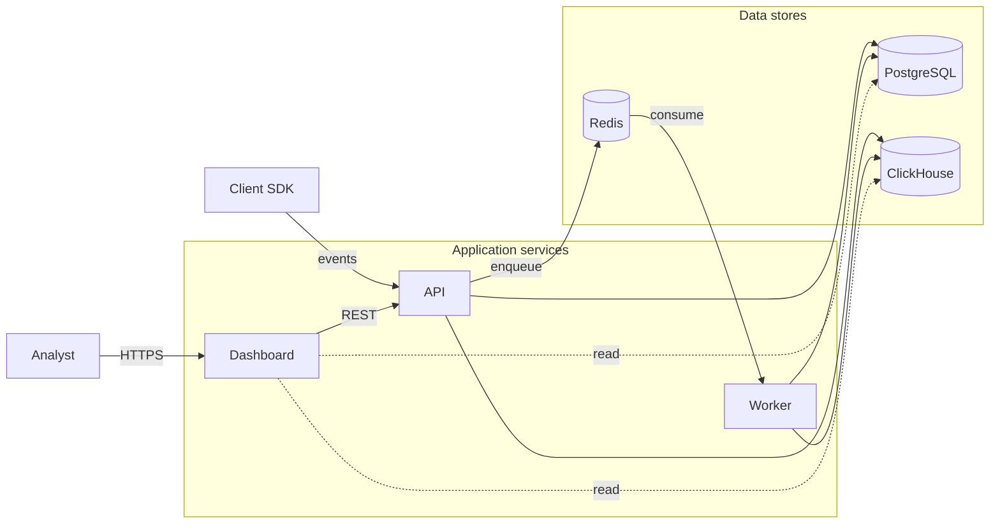
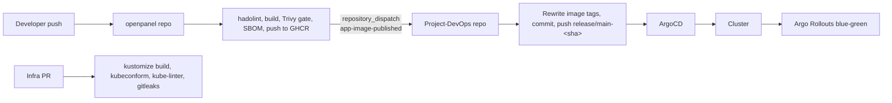

# Final Project Proposal — OpenPanel on Kubernetes (GitOps)

---


| | |
|---|---|
| Project name | OpenPanel on Kubernetes — end-to-end GitOps delivery |
| Student | Rubén López Solé |
| Date | April 2026 |
| Specialty | GitOps (ArgoCD, Argo Rollouts, Sealed Secrets) |
| Programme | Master's in DevOps & Cloud Computing |
| Application | [OpenPanel](https://github.com/Openpanel-dev/openpanel) |
| Repository | This repo (Project-DevOps) is the source of truth for both cluster and app state |

---

## Summary

The application selected for this project is OpenPanel, an open-source analytics platform maintained by `openpanel-dev/openpanel`. It was chosen because its architecture reflects the type of distributed application commonly found in modern production environments. OpenPanel is built from several independent services and technologies, making it a realistic example of a modern cloud-native application. The app includes a Next.js dashboard for the frontend, a Fastify API responsible for ingesting analytics events, and a BullMQ worker that processes background jobs asynchronously. The application also relies on multiple databases with distinct responsibilities: PostgreSQL for relational data, ClickHouse for analytics and event storage, and Redis for queues and caching.

This architecture made OpenPanel an ideal candidate for the project because it introduced challenges that go beyond simply deploying containers. Managing communication between services, handling asynchronous workloads, monitoring system health, automating deployments, and operating multiple storage systems created the opportunity to design and validate a complete DevOps project around a realistic application stack.

The main focus of the thesis is **GitOps**. The infrastructure and Kubernetes resources are fully defined in Git, allowing the repository to act as the single source of truth for the project. Changes follow a predictable workflow: configurations are committed to Git, validated automatically through CI pipelines, and then synchronized to the cluster by ArgoCD. This approach simplifies deployment management, improves traceability, and makes rollbacks straightforward through standard Git operations.

Although GitOps is the core specialization of the project, several DevSecOps practices were also integrated into the project. These include container image scanning, secret detection with Gitleaks, Kubernetes manifest validation with kube-linter, non-root container execution, and network isolation through Kubernetes NetworkPolicies.

The final project runs on a three-node Kubernetes cluster, using Minikube for local environments and AWS EKS as the production-oriented design. OpenPanel is deployed through the ArgoCD App-of-Apps pattern, while Argo Rollouts manages progressive delivery strategies for the API service. Secrets are encrypted using Sealed Secrets, observability is provided through Prometheus, Grafana, Loki, and Tempo, and backups are managed with Velero using S3-compatible object storage provisioned through Terraform.

The CI/CD workflow is implemented with GitHub Actions. The application repository builds and publishes container images, then triggers the infrastructure repository through a `repository_dispatch` event. The infrastructure pipeline updates the Kubernetes image tags in Git, after which ArgoCD automatically reconciles the new desired state into the cluster.


## Application Architecture

The following diagram provides a high-level overview of the platform architecture. External users and client SDKs interact with the application layer, which is composed of the Dashboard, API, and Worker services. These services communicate with the underlying data layer, formed by PostgreSQL, ClickHouse, and Redis. 

The deployment process also includes a dedicated Prisma migration job that runs independently during each deployment to ensure database schemas remain synchronized with the application version.


### Application Components

The application architecture is divided into two main layers:

- **Application services**
- **Data services**

Clients send analytics events to the API, while analysts interact with the Dashboard through the web interface. The API and Worker services manage background processing and communication with PostgreSQL, ClickHouse, and Redis.




### Component Overview

| Component            | Technology                    | Responsibility                                                                                              |
| -------------------- | ----------------------------- | ----------------------------------------------------------------------------------------------------------- |
| Dashboard            | Next.js application           | Provides the user interface for projects, dashboards, analytics views, funnels, and cohorts                 |
| API                  | Fastify-based Node.js service | Handles event ingestion, dashboard requests, authentication, and queue management                           |
| Worker               | Node.js service using BullMQ  | Processes background jobs, scheduled tasks, and asynchronous aggregations                                   |
| PostgreSQL           | Kubernetes StatefulSet        | Stores relational application data such as users, projects, and configuration                               |
| ClickHouse           | Kubernetes StatefulSet        | Stores analytics events and executes high-volume analytical queries                                         |
| Redis                | Kubernetes StatefulSet        | Provides queue storage, caching, and pub/sub functionality                                                  |
| Prisma migration job | Kubernetes Job                | Executes database schema migrations after PostgreSQL becomes available and before the API deployment starts |


### Data Flow

Client SDKs send analytics events to the API service. The API validates incoming requests and stores analytics data in ClickHouse, while relational and application-specific metadata is written to PostgreSQL.

Operations that may take longer to process, such as aggregations, retention tasks, or exports, are handled asynchronously. Instead of executing this work directly in the request path, the API places jobs into Redis using BullMQ. The Worker service then processes these jobs independently and writes the resulting data back to ClickHouse or PostgreSQL as needed.

The Dashboard retrieves data through the API layer, which queries both databases depending on the type of information requested.

Database schema migrations are managed through a dedicated Prisma migration job executed during deployment. The migration job runs in its own ArgoCD sync wave after PostgreSQL becomes available but before the API pods are started. An init container explicitly waits for the PostgreSQL port to become reachable before migrations begin, reducing the risk of startup timing issues.

This deployment order ensures that database migrations complete successfully before the application is updated, preventing schema mismatches between new application versions and existing database structures.

---

## Infrastructure Architecture

This section describes the infrastructure and application components used to deploy and operate the application. The project is designed around a Kubernetes-based architecture that supports local development with Minikube and a production-oriented deployment model targeting AWS EKS.

The infrastructure layer includes Kubernetes orchestration, infrastructure provisioning with Terraform, persistent storage, observability, backup management, and cloud integration.

### Infrastructure Layers


---

### Kubernetes Cluster Design

The local environment runs on a three-node Minikube cluster composed of:

- One dedicated control-plane node
- Two worker nodes

The control-plane node is tainted to prevent application workloads from being scheduled on it. The worker nodes are labelled according to their responsibility:

- `workload=app`
- `workload=observability`

These labels are used by Kubernetes node affinity rules to separate application workloads from monitoring and observability services. This separation improves resource isolation and reflects the same scheduling model planned for the AWS EKS environment.

The same node labels and affinity rules can be reused directly in EKS node groups, ensuring consistent workload placement across local and cloud environments.

### Persistent Storage and Backups

Stateful services within the project are configured with persistent storage to ensure data survives pod restarts, rescheduling events, and cluster updates.

The following components use persistent volumes:

- PostgreSQL
- ClickHouse
- Redis
- Tempo

Redis persistence is enabled to avoid losing queued background jobs, while Tempo stores traces on persistent volumes to retain observability data across deployments and pod restarts.

Backup and recovery operations are managed with Velero. The local and staging environments use MinIO as an S3-compatible storage backend, while the production-oriented AWS design uses Amazon S3 for long-term backup storage.

---

#### Terraform Modules

| Module | Purpose | Used by |
|---|---|---|
| `modules/backup-storage` | Creates the S3 bucket for Velero backups with versioning, encryption, and public access restrictions, plus a Secrets Manager slot for the Sealed Secrets RSA key backup | staging + prod |
| `modules/iam-user` | Creates an IAM user and access key for staging and LocalStack environments | staging |
| `modules/iam-irsa` | Creates an IAM role with OIDC trust for EKS service accounts | prod |

#### Environment Layout

| Environment | State Backend | Target Platform |
|---|---|---|
| `environments/staging` | Local state | LocalStack |
| `environments/prod` | S3 backend with DynamoDB locking | AWS |


The repository intentionally focuses on the infrastructure components required to validate the project locally. For this reason, the implementation does not provision a full production AWS environment with Terraform modules for VPCs, EKS clusters, RDS, or ElastiCache.

Instead, the project includes a production-oriented AWS architecture design that demonstrates how the application would be deployed in a real cloud environment. This design includes:

- A VPC distributed across multiple availability zones
- Public and private subnets
- EKS worker nodes running in private subnets
- An Application Load Balancer exposed publicly
- RDS for PostgreSQL
- ElastiCache for Redis
- S3 for backup storage
- IAM Roles for Service Accounts (IRSA)

---

### AWS Target Architecture

The following diagram illustrates the intended production deployment model on AWS.


## CI/CD Strategy

### Pipeline Overview

The project uses a GitOps-based CI/CD workflow split across two repositories:

- The **application repository**, which contains the OpenPanel source code and container build pipelines.
- The **infrastructure repository**, which contains the Kubernetes manifests, GitOps configuration, Terraform modules, and platform automation.

This separation keeps application delivery and infrastructure management independent while still allowing both pipelines to work together through automated events.




### Continuous Integration

Continuous Integration is intentionally divided between the application and infrastructure repositories. The OpenPanel repository changes frequently because it contains the application source code, while the infrastructure repository changes less often and focuses on platform configuration. Keeping the pipelines separate avoids unnecessary container rebuilds when only infrastructure or Kubernetes configuration changes.


### Application Pipeline

The application pipeline is implemented in `openpanel/.github/workflows/build-publish.yml`.

The workflow performs the following stages:

1. **Dockerfile validation**

    `hadolint` validates all Dockerfiles to detect common container build issues and Dockerfile best-practice violations.

2. **Container image builds**

    The pipeline builds the `api`, `worker`, and `dashboard` images using a matrix strategy.

3. **Security scanning**

    Trivy scans the resulting images for vulnerabilities. The pipeline fails automatically if HIGH or CRITICAL vulnerabilities are detected. Scan results are uploaded to the GitHub Security tab in SARIF format to simplify vulnerability review and tracking.

4. **SBOM generation**

    Syft generates a Software Bill of Materials (SBOM) for each build, providing visibility into image dependencies and packages.

5. **Container image publishing**

    Images are pushed to GitHub Container Registry (GHCR). The workflow generates both semantic version tags and commit-based tags such as `main-<sha>`.


6. **GitOps trigger**

    After a successful image push, the pipeline sends a `repository_dispatch` event named `app-image-published`. This event triggers the infrastructure repository workflow responsible for updating the Kubernetes manifests.
  

---

### Infrastructure Validation Pipeline

The infrastructure validation pipeline is implemented in `Project-DevOps/.github/workflows/ci-validate.yml`. The workflow validates Kubernetes manifests and infrastructure configuration before changes are merged.

The pipeline performs the following checks:

1. **Kustomize rendering**

    `kustomize build` is executed for all overlays and environments, including:

    - OpenPanel application overlays
    - Observability stack
    - Argo Rollouts
    - cert-manager
    - Velero
    - local-path-provisioner

2. **Kubernetes schema validation**

    `kubeconform` validates manifests against the Kubernetes API version used by the target cluster.

3. **Kubernetes best-practice validation**

    `kube-linter` detects common Kubernetes configuration problems, including:

    - Missing resource limits
    - Usage of `latest` image tags
    - Containers running as root

4. **Secret scanning**

    `gitleaks` scans changes for accidentally committed credentials or sensitive information.

  
---


### Security and Dependency Management

The CI pipelines follow several security-oriented practices. All CI tooling is downloaded using SHA-256 checksum verification, and GitHub Actions workflows use minimal default token permissions (`read-only`) wherever possible.

Both repositories also use Dependabot for automated dependency updates. The infrastructure repository monitors:

- GitHub Actions versions
- Terraform providers and modules

The application repository monitors:

- GitHub Actions
- npm dependencies across the pnpm workspace
- Docker base images

Dependency updates are automatically proposed through pull requests and validated through the same CI workflows used for regular development changes.


----

### Continuous Deployment (CD)

The Continuous Deployment workflow is implemented through the `cd-update-tags.yml` pipeline in the infrastructure repository.

This workflow is triggered automatically when the application repository publishes a new container image and sends the `app-image-published` `repository_dispatch` event.

When the event is received, the pipeline performs the following steps:

1. Reads the image version and commit SHA included in the event payload.
2. Updates the image tags referenced in the Kubernetes manifests.
3. Commits the updated manifests back into the infrastructure repository.
4. Creates a Git tag using the format: `release/main-<sha>`

ArgoCD is configured to monitor these release tags. During the next synchronization cycle, it detects the updated manifests and applies the new desired state to the Kubernetes cluster.

This approach keeps deployments fully Git-driven, ensuring that the Git repository remains the single source of truth for the platform state.


---

### Progressive Delivery with Argo Rollouts

Application deployment inside the cluster is managed by Argo Rollouts rather than standard Kubernetes Deployments.

The API service runs as an Argo Rollouts `Rollout` resource using a blue-green deployment strategy. When a new application version is deployed, Argo Rollouts creates a new ReplicaSet alongside the currently active version.

The new version is exposed through a dedicated preview service: `openpanel-api-preview`, while production traffic continues to use`openpanel-api`.

This separation allows the new release to be validated before traffic is switched to it.

Automatic promotion is intentionally disabled:`autoPromotionEnabled: false`.

This makes the final promotion step manual, allowing smoke tests and validation checks to be executed against the preview version before exposing it to users.

The rollout configuration also keeps the previous ReplicaSet running for a limited time after promotion:

```yaml
scaleDownDelaySeconds: 600
```

This improves rollback speed because the previous version remains available and does not need to scale up again if a rollback is required.

Previous revisions are also retained using:

```yaml
revisionHistoryLimit: 3
```

which simplifies recovery from failed deployments.


---

### Environment Configuration

The local implementation does not use a dedicated staging Kubernetes cluster. Instead, environment separation is handled through Kustomize overlays.

The project defines separate overlays for `staging` and `prod` environments using [Kustomize](https://kustomize.io/). Both overlays reuse the same Kubernetes base manifests while applying environment-specific configuration changes.

This structure mirrors how multiple ArgoCD instances or Kubernetes clusters would typically be managed in a production cloud environment while keeping the local implementation lightweight and reproducible.


---

## Observability

Observability was designed as a core part of the platform. The goal was not only to collect metrics and logs, but also to provide enough visibility to understand application behaviour, troubleshoot failures, and validate deployments in real time.

The stack combines metrics, logs, traces, dashboards, and alerting into a single monitoring platform integrated directly into Kubernetes.


### Observability Stack


| Pillar | Tool | Purpose |
|---|---|---|
| Metrics | Prometheus | Metrics collection and monitoring |
| Logs | Loki + Promtail | Centralized log aggregation |
| Traces | Tempo | Distributed tracing |
| Dashboards | Grafana | Visualization and operational dashboards |
| Alerts | Alertmanager | Alert routing and notification management |

The observability stack is deployed inside the Kubernetes cluster using a combination of:

- `kube-prometheus-stack`
- Loki
- Promtail
- Tempo
- Grafana
- Alertmanager

Promtail runs as a DaemonSet on every node and forwards container logs to Loki. Grafana is configured automatically through ConfigMaps and sidecar discovery, allowing dashboards to be provisioned without manual imports.

Tempo uses persistent storage to retain traces across pod restarts, while Alertmanager is configured to route alerts to Slack and optionally PagerDuty in the production-oriented design.

---
### Metrics Collection

The platform collects metrics from three main areas:

- Application services
- Data stores
- Kubernetes infrastructure

#### Application Metrics

For each OpenPanel service, the following metrics are collected:

- Request rate
- Error rate
- P95 and P99 latency
- Node.js event loop lag
- Queue depth through the Redis exporter

These metrics provide visibility into API responsiveness, worker throughput, and background job processing.

#### Database and Queue Metrics

The data layer exports operational metrics through dedicated exporters:

| Service | Exporter | Metrics |
|---|---|---|
| PostgreSQL | `postgres_exporter` | Active connections, query statistics |
| Redis | `redis_exporter` | Memory usage, queue metrics |
| ClickHouse | Built-in Prometheus endpoint (port 9363) | Table sizes, insert rates, row counts |

#### Kubernetes Metrics

Cluster-level metrics are collected through `kube-state-metrics` and `node-exporter`.

These include:

- Pod CPU and memory usage
- Pod lifecycle state
- Restart counts
- Persistent volume utilization
- Node resource pressure
- Disk usage

Together, these metrics provide visibility into both application health and Kubernetes cluster stability.

---

### Logging and Tracing

Container logs are collected by Promtail and forwarded to Loki with labels including:

- `namespace`
- `app`
- `pod`
- `container`

This labeling structure makes it easier to filter and correlate logs across services.

Distributed tracing is implemented with Tempo and integrated into Grafana. When a log line contains a `traceID`, Grafana automatically generates a link to the matching distributed trace. 
This integration significantly simplifies troubleshooting during failures and performance investigations.

---

### Alerting Strategy

The project implements alerting for both the application itself and the observability stack. The alerts are divided into two groups:

- Application and infrastructure alerts
- Alertmanager self-monitoring alerts

---

### Application and Infrastructure Alerts

| Alert | Condition | Duration | Severity |
|---|---|---|---|
| `APIDown` | API unavailable | 2 min | critical |
| `HighErrorRate` | 5xx responses exceed 5% | 5 min | critical |
| `APIHighLatency` | P99 latency exceeds 2s | 5 min | warning |
| `NodeJSEventLoopLag` | Event loop lag exceeds 500ms | 5 min | warning |
| `HighMemoryUsage` | Container memory exceeds 90% of limit | 5 min | warning |
| `PostgresDown` | PostgreSQL unavailable | 2 min | critical |
| `RedisDown` | Redis unavailable | 2 min | critical |

---

### Alertmanager Self-Monitoring

| Alert | Condition | Duration | Severity |
|---|---|---|---|
| `AlertmanagerDown` | Alertmanager unavailable | 5 min | critical |
| `AlertmanagerFailedReload` | Configuration reload failed | 10 min | warning |
| `AlertmanagerNotificationFailures` | Notification delivery failures detected | 5 min | warning |

---

### Alert Routing and Notification Management

Alertmanager is configured independently from the main Prometheus stack to simplify routing changes and notification testing.
Once an alert fires and passes its configured threshold window, Prometheus forwards it to Alertmanager, which then decides how the notification should be routed.
The routing configuration groups alerts by:`alertname`,`namespace`,`severity`.


#### Notification Receivers

The project currently uses Slack as the primary notification channel.

| Receiver | Purpose |
|---|---|
| Slack | Operational alert notifications |
| PagerDuty | Planned production-oriented escalation receiver |


Slack notifications are sent to a dedicated alert channel and include resolved notifications to provide full visibility into the alert lifecycle. PagerDuty is included in the production-oriented design as an additional receiver for critical alerts requiring escalation outside normal working hours.

---

### Grafana Dashboards

Three custom Grafana dashboards were created specifically for the project. The dashboards are stored as JSON files inside:`grafana-dashboards`directory.
Grafana automatically loads these dashboards through sidecar discovery during cluster startup.

#### OpenPanel Dashboard

The application dashboard focuses on service-level metrics.

  

---

#### Cluster Dashboard

The cluster dashboard provides infrastructure-level visibility across the Kubernetes environment.

  

---

#### Logs and Traces Dashboard

This dashboard combines Loki logs and Tempo traces in a single troubleshooting view.
A log entry containing a `traceID` can be opened directly in Tempo from Grafana, allowing rapid correlation between logs and distributed traces.

  

---

### Alertmanager Interface

The following screenshot shows Alertmanager handling active alerts and routing them according to the configured notification rules.


---

## Security Strategy

Security was integrated into the project. The overall approach combines GitOps principles with secure secret management, progressive delivery, infrastructure isolation, and automated validation inside the CI/CD pipeline.
The platform focuses on three main areas:

- Secure secret handling
- Backup and recovery protection


### Secret Management

The project uses Bitnami Sealed Secrets to manage sensitive information securely within a GitOps workflow.


Traditional Kubernetes `Secret` manifests cannot safely be stored in Git repositories because they contain plaintext sensitive data. Sealed Secrets solve this problem by encrypting secrets before they are committed to Git.
Inside the cluster, the Sealed Secrets controller decrypts these resources back into native Kubernetes `Secret` objects.The controller runs with an RSA-4096 encryption key generated automatically during cluster setup. The private key is backed up locally at`~/.config/openpanel/sealing-key.yaml`. This backup allows the Kubernetes cluster to be rebuilt without invalidating the encrypted `SealedSecret` manifests already stored in Git.


### Secret Management Workflow

The project includes several helper scripts to automate secret management:

| Script | Purpose |
|---|---|
| `ensure-sealing-key.sh` | Generates or restores the Sealed Secrets keypair |
| `reseal-secrets.sh` | Re-encrypts plaintext secrets into `SealedSecret` manifests |
| `stabilize-secrets.sh` | Verifies that all Kubernetes Secrets are successfully created after deployment |

These scripts are integrated into the cluster bootstrap process to ensure secrets remain synchronized and reproducible across environments.


#### Cluster Bootstrap Process

During cluster initialization, the stored sealing key is restored before ArgoCD applications are synchronized. This ensures that previously encrypted secrets remain valid after rebuilding the cluster.


### Future Migration to External Secrets Operator

For a production-oriented AWS deployment, the preferred long-term approach would be replacing Sealed Secrets with the External Secrets Operator (ESO) integrated with AWS Secrets Manager.

This design is already considered in the project. The GitOps workflow would remain unchanged because the `ExternalSecret` manifests would still be managed through Git and synchronized by ArgoCD.


## TLS and Certificate Management

TLS certificates are managed through cert-manager.


cert-manager automates:

- Certificate issuance
- Certificate renewal
- Kubernetes TLS secret creation
- Ingress certificate integration

This removes the need for manually managing TLS certificates and simplifies secure service exposure inside the cluster.

---

## Security Validation in CI/CD

Security validation is integrated directly into the CI/CD workflows.

The pipelines include:

- Trivy vulnerability scanning
- Gitleaks secret detection
- kube-linter validation
- Non-root container enforcement
- Kubernetes NetworkPolicies

These checks help prevent common security issues from reaching the cluster while keeping the deployment process fully automated and reproducible.

---


## Backup and Disaster Recovery

The project includes a backup and recovery strategy based on Velero together with S3-compatible object storage. The same backup workflow is used across environments, while the storage backend changes depending on the deployment target. Two storage models are supported:

- MinIO for local and staging environments
- Amazon S3 for the AWS-oriented production design

The backup strategy is designed to protect both Kubernetes resources and application data, allowing the platform to be recovered after failures, accidental deletion, or cluster rebuilds.

---

### Backup Scope

This project uses two complementary backup layers:

#### Kubernetes Resource Backups

Velero is responsible for backing up Kubernetes resources, including:

- Deployments
- Services
- ConfigMaps
- Secrets
- Persistent volume metadata

These backups allow the Kubernetes state of the platform to be restored into a new cluster.

#### Application Data Backups

Stateful services are backed up independently using native database backup mechanisms:

| Service | Backup Method |
|---|---|
| PostgreSQL | `pg_dump` database export |
| Redis | RDB snapshot |
| ClickHouse | Native database backup |

This separation keeps infrastructure recovery and application data recovery independent and easier to manage.

---

### Backup Flow — Staging

The local and staging environments use MinIO as an S3-compatible storage backend running inside the Kubernetes cluster.


---

### Backup Flow — Production

The production-oriented AWS design uses Amazon S3 as the backup storage backend.


The production design uses IRSA (IAM Roles for Service Accounts) to allow Velero to authenticate with AWS securely without storing static cloud credentials inside the cluster.

---

### Backup Scheduling

Automated backups are configured through Velero schedules.

| Schedule | Frequency | Environment |
|---|---|---|
| `daily-full-backup` | Daily | staging + prod |
| `hourly-database-backup` | Hourly | prod |

---

### Backup and Restore Operations

All backup and restore operations are managed through `scripts/backup-restore.sh`

Example commands:

```bash
# Create a Velero backup
./scripts/backup-restore.sh backup

# Create database backups
./scripts/backup-restore.sh backup-db

# List available backups
./scripts/backup-restore.sh list
```

Restore operations are performed using:

```bash
./scripts/backup-restore.sh restore <backup-name>
```

Velero restores the Kubernetes resources stored in the backup, while database backups can be restored separately when needed.

---

### Disaster Recovery

Velero is responsible for:

- Kubernetes resource backups
- Persistent volume snapshot backups
- Restore operations
- Disaster recovery workflows

This approach makes it possible to rebuild the platform and recover application state after infrastructure failures or cluster recreation.

---


## References

### Application

- OpenPanel — https://github.com/Openpanel-dev/openpanel
- OpenPanel docs — https://docs.openpanel.dev
- Prisma migrate as a Kubernetes hook — https://www.prisma.io/docs/orm/prisma-migrate

### GitOps and progressive delivery

- ArgoCD — https://argo-cd.readthedocs.io/
- App-of-Apps — https://argo-cd.readthedocs.io/en/stable/operator-manual/cluster-bootstrapping/
- Argo Rollouts — https://argoproj.github.io/argo-rollouts/
- Sealed Secrets — https://github.com/bitnami-labs/sealed-secrets
- External Secrets Operator — https://external-secrets.io/

### CI/CD and supply chain

- GitHub Actions — https://docs.github.com/actions
- `docker/metadata-action` — https://github.com/docker/metadata-action
- Trivy — https://trivy.dev
- Syft — https://github.com/anchore/syft
- hadolint — https://github.com/hadolint/hadolint
- kubeconform — https://github.com/yannh/kubeconform
- kube-linter — https://docs.kubelinter.io/
- gitleaks — https://github.com/gitleaks/gitleaks

### Observability

- kube-prometheus-stack — https://github.com/prometheus-community/helm-charts/tree/main/charts/kube-prometheus-stack
- Loki — https://grafana.com/docs/loki/latest/
- Tempo — https://grafana.com/docs/tempo/latest/
- Prometheus alerting — https://prometheus.io/docs/practices/alerting/

### Infrastructure and backup

- Terraform AWS provider — https://registry.terraform.io/providers/hashicorp/aws/latest
- Velero — https://velero.io/
- IAM Roles for Service Accounts (IRSA) — https://docs.aws.amazon.com/eks/latest/userguide/iam-roles-for-service-accounts.html
- LocalStack — https://docs.localstack.cloud/

### Reference repositories

- `argoproj/argocd-example-apps` — https://github.com/argoproj/argocd-example-apps
- `prometheus-operator/kube-prometheus` — https://github.com/prometheus-operator/kube-prometheus
