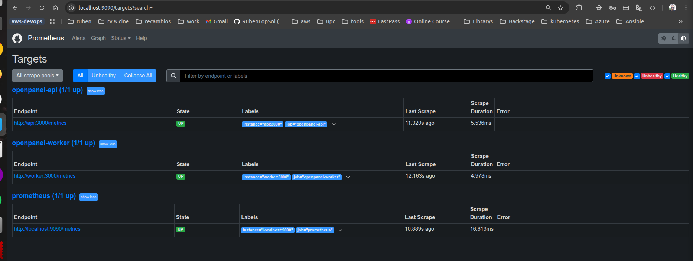
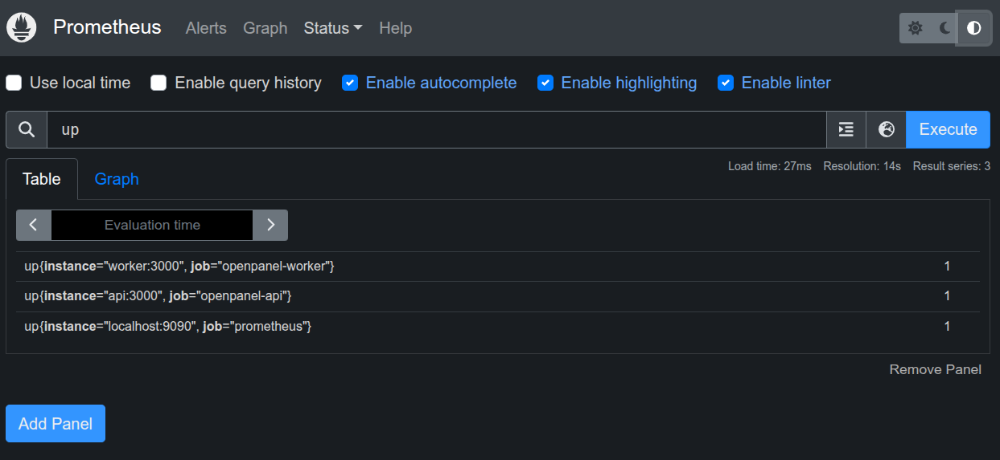
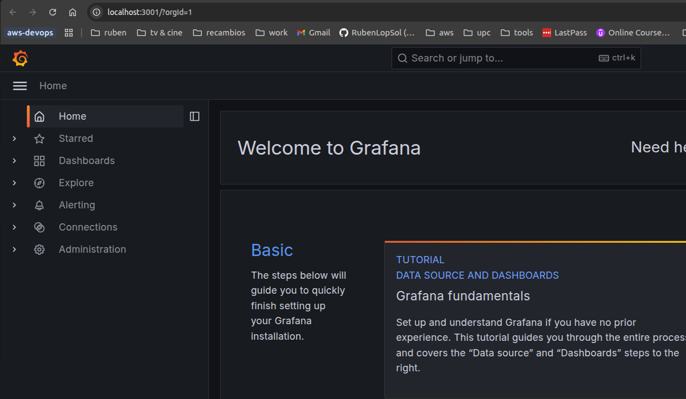
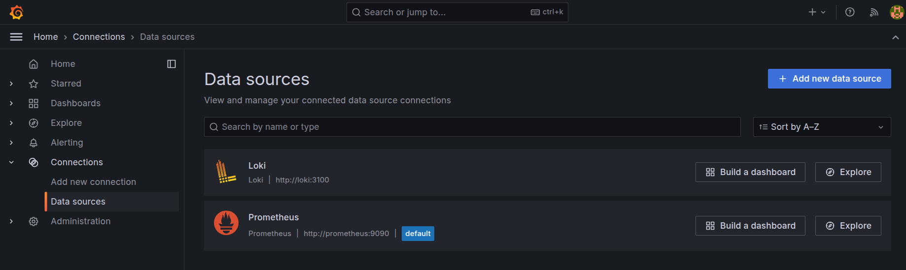
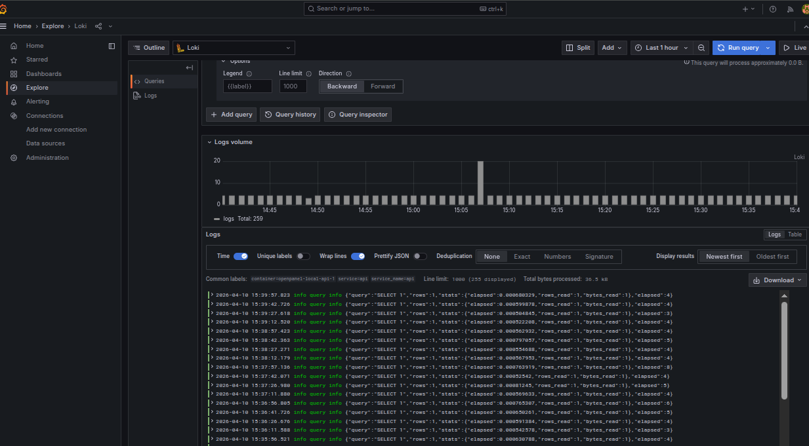
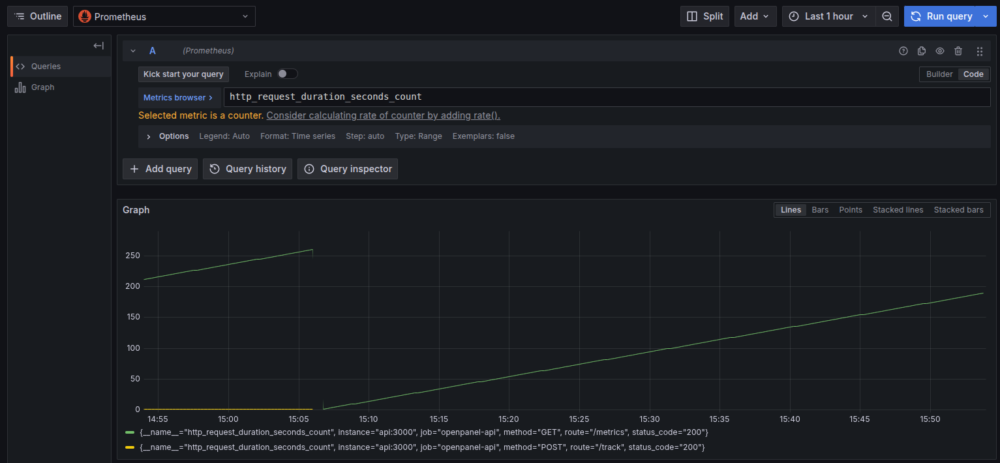

# Verificación Observabilidad Local — Docker Compose

Verificación manual del stack de observabilidad corriendo en local.

**Servicios:**
- Prometheus `http://localhost:9090`
- Grafana `http://localhost:3001` (admin/admin)
- Loki `http://localhost:3100`
- Promtail (sin UI — recolector de logs)

---

## 1. Prometheus — Targets

URL: http://localhost:9090/targets

**Captura:**



**Resultado:**

`curl -s http://localhost:9090/api/v1/targets | jq '.data.activeTargets[] | {job: .labels.job, health: .health, lastError: .lastError}'`
```json
{
  "job": "openpanel-api",
  "health": "up",
  "lastError": ""
}
{
  "job": "openpanel-worker",
  "health": "up",
  "lastError": ""
}
{
  "job": "prometheus",
  "health": "up",
  "lastError": ""
}
```
---

## 2. Prometheus — Métricas de la API

URL: http://localhost:9090 → query `up`

**Captura:**



**Resultado:**

`curl -s http://localhost:9090/api/v1/query\?query\=up | jq`
```json
{
  "status": "success",
  "data": {
    "resultType": "vector",
    "result": [
      {
        "metric": {
          "__name__": "up",
          "instance": "worker:3000",
          "job": "openpanel-worker"
        },
        "value": [
          1775827205.884,
          "1"
        ]
      },
      {
        "metric": {
          "__name__": "up",
          "instance": "api:3000",
          "job": "openpanel-api"
        },
        "value": [
          1775827205.884,
          "1"
        ]
      },
      {
        "metric": {
          "__name__": "up",
          "instance": "localhost:9090",
          "job": "prometheus"
        },
        "value": [
          1775827205.884,
          "1"
        ]
      }
    ]
  }
}
```
---

## 3. Loki — Health

```bash
curl http://localhost:3100/ready
```

**Resultado:**
```json
ready
```

---

## 4. Promtail — Scraping de logs

Promtail no expone puerto externo — se verifica por logs:

```bash
docker compose logs promtail --tail=20
```

**Resultado:**
``` json
Promtail detectando y enviando logs de todos los contenedores a Loki correctamente.
- `added Docker target` — detecta cada contenedor del compose
- `finished transferring logs` — envía logs a Loki sin errores
- Los errores `No such container` son normales — contenedores de sesiones anteriores ya eliminados
```
---

## 5. Grafana — Datasources

URL: http://localhost:3001 → Connections → Data sources

**Captura:**



**Resultado:**


**Nota — Tempo (trazas distribuidas):**

Tempo **no está configurado en Docker Compose** de forma intencionada. Las trazas distribuidas solo aportan valor real cuando hay múltiples servicios corriendo en nodos distintos — exactamente el escenario de Kubernetes con varios pods y nodos.

En el stack local (Docker Compose), todos los servicios comparten red y proceso; instrumentar trazas aquí no refleja el comportamiento real en producción.

Tempo se añade como datasource en Grafana **en el stack de Kubernetes** (`k8s/infrastructure/base/observability/`) junto con el resto del stack de observabilidad completo (kube-prometheus-stack, Loki, Promtail, Tempo).
---

## 6. Grafana — Explorar logs en Loki

URL: http://localhost:3001 → Explore → Loki

**Captura:**



**Resultado:**

`curl -s "http://localhost:3100/loki/api/v1/query_range?query=%7Bservice%3D%22api%22%7D&limit=3" | jq '.data.result[0].values[0:2]'`
```json
[
  [
    "1775828533525106602",
    "\u001b[32minfo\u001b[39m \u001b[32mquery info\u001b[39m {\"query\":\"SELECT 1\",\"rows\":1,\"stats\":{\"elapsed\":0.000547443,\"rows_read\":1,\"bytes_read\":1},\"elapsed\":3}"
  ],
  [
    "1775828518457151023",
    "\u001b[32minfo\u001b[39m \u001b[32mquery info\u001b[39m {\"query\":\"SELECT 1\",\"rows\":1,\"stats\":{\"elapsed\":0.000643782,\"rows_read\":1,\"bytes_read\":1},\"elapsed\":4}"
  ]
]
```
---

## 7. Grafana — Explorar métricas en Prometheus

URL: http://localhost:3001 → Explore → Prometheus

**Captura:**



**Resultado:**

`curl -s "http://localhost:9090/api/v1/query?query=http_request_duration_seconds_count" | jq '.data.result[0].metric'`
``` json 
{
  "status": "success",
  "data": {
    "resultType": "vector",
    "result": [
      {
        "metric": {
          "__name__": "http_request_duration_seconds_count",
          "instance": "api:3000",
          "job": "openpanel-api",
          "method": "GET",
          "route": "/metrics",
          "status_code": "200"
        },
        "value": [
          1775829346.124,
          "197"
        ]
      }
    ]
  }
}
```