# Propuesta de Proyecto Final — OpenPanel sobre Kubernetes (GitOps)

---


| | |
|---|---|
| Nombre del proyecto | OpenPanel sobre Kubernetes — entrega GitOps de extremo a extremo |
| Estudiante | Rubén López Solé |
| Fecha | Abril 2026 |
| Especialidad | GitOps (ArgoCD, Argo Rollouts, Sealed Secrets) |
| Programa | Máster en DevOps & Cloud Computing |
| Aplicación | [OpenPanel](https://github.com/Openpanel-dev/openpanel) |
| Repositorio | Este repositorio (Project-DevOps) es la fuente única de verdad tanto para el estado del clúster como del de la aplicación |

---

## Resumen

La aplicación seleccionada para este proyecto es OpenPanel, una plataforma de analítica de código abierto mantenida por `openpanel-dev/openpanel`. Se eligió porque su arquitectura refleja el tipo de aplicación distribuida que se encuentra habitualmente en entornos de producción modernos. OpenPanel se construye a partir de varios servicios y tecnologías independientes, lo que la convierte en un ejemplo realista de aplicación cloud-native moderna. La aplicación incluye un dashboard en Next.js para el frontend, una API basada en Fastify responsable de la ingesta de eventos de analítica, y un worker BullMQ que procesa trabajos en segundo plano de forma asíncrona. La aplicación también depende de varias bases de datos con responsabilidades diferenciadas: PostgreSQL para datos relacionales, ClickHouse para almacenamiento de eventos y analítica, y Redis para colas y caché.

Esta arquitectura convirtió a OpenPanel en una candidata ideal para el proyecto porque planteó retos que van más allá del simple despliegue de contenedores. Gestionar la comunicación entre servicios, manejar cargas de trabajo asíncronas, monitorizar la salud del sistema, automatizar despliegues y operar varios sistemas de almacenamiento creó la oportunidad de diseñar y validar un proyecto DevOps completo en torno a un stack de aplicación realista.

El foco principal de la tesis es **GitOps**. La infraestructura y los recursos de Kubernetes se definen completamente en Git, permitiendo que el repositorio actúe como fuente única de verdad para el proyecto. Los cambios siguen un flujo predecible: las configuraciones se confirman en Git, se validan automáticamente mediante pipelines de CI y, después, se sincronizan con el clúster mediante ArgoCD. Este enfoque simplifica la gestión de despliegues, mejora la trazabilidad y hace que los rollbacks sean directos mediante operaciones estándar de Git.

Aunque GitOps es la especialización central del proyecto, también se integraron varias prácticas de DevSecOps. Estas incluyen el escaneo de imágenes de contenedor, la detección de secretos con Gitleaks, la validación de manifiestos de Kubernetes con kube-linter, la ejecución de contenedores como usuario no root y el aislamiento de red mediante NetworkPolicies de Kubernetes.

El proyecto final se ejecuta sobre un clúster de Kubernetes de tres nodos, utilizando Minikube para entornos locales y AWS EKS como diseño orientado a producción. OpenPanel se despliega mediante el patrón App-of-Apps de ArgoCD, mientras que Argo Rollouts gestiona estrategias de entrega progresiva para el servicio API. Los secretos se cifran utilizando Sealed Secrets, la observabilidad se proporciona a través de Prometheus, Grafana, Loki y Tempo, y las copias de seguridad se gestionan con Velero usando almacenamiento de objetos compatible con S3 aprovisionado mediante Terraform.

El flujo de CI/CD se implementa con GitHub Actions. El repositorio de la aplicación construye y publica las imágenes de contenedor y, a continuación, dispara el repositorio de infraestructura mediante un evento `repository_dispatch`. El pipeline de infraestructura actualiza las etiquetas de imagen de Kubernetes en Git, tras lo cual ArgoCD reconcilia automáticamente el nuevo estado deseado en el clúster.


## Arquitectura de la Aplicación

El siguiente diagrama proporciona una visión general de alto nivel de la arquitectura de la plataforma. Los usuarios externos y los SDK de cliente interactúan con la capa de aplicación, compuesta por los servicios Dashboard, API y Worker. Estos servicios se comunican con la capa de datos subyacente, formada por PostgreSQL, ClickHouse y Redis.

El proceso de despliegue también incluye un job dedicado de migración de Prisma que se ejecuta de forma independiente durante cada despliegue para garantizar que los esquemas de base de datos permanezcan sincronizados con la versión de la aplicación.


### Componentes de la Aplicación

La arquitectura de la aplicación se divide en dos capas principales:

- **Servicios de aplicación**
- **Servicios de datos**

Los clientes envían eventos de analítica a la API, mientras que los analistas interactúan con el Dashboard a través de la interfaz web. Los servicios API y Worker gestionan el procesamiento en segundo plano y la comunicación con PostgreSQL, ClickHouse y Redis.


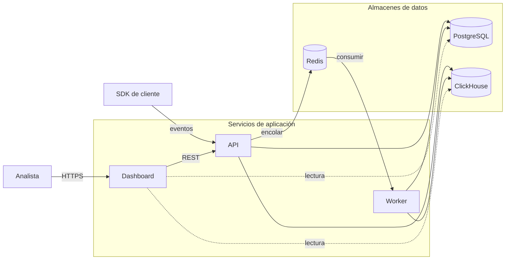
```mermaid
flowchart LR
  Client[SDK de cliente]
  User[Analista]

  subgraph App[Servicios de aplicación]
    direction TB
    Dashboard[Dashboard]
    API[API]
    Worker[Worker]
  end

  subgraph Data[Almacenes de datos]
    direction TB
    PG[(PostgreSQL)]
    CH[(ClickHouse)]
    Redis[(Redis)]
  end

  Client -- eventos --> API
  User -- HTTPS --> Dashboard
  Dashboard -- REST --> API

  API --> PG
  API --> CH
  API -- encolar --> Redis
  Redis -- consumir --> Worker
  Worker --> PG
  Worker --> CH
  Dashboard -. lectura .-> PG
  Dashboard -. lectura .-> CH
```

### Visión General de los Componentes

| Componente            | Tecnología                    | Responsabilidad                                                                                              |
| --------------------- | ----------------------------- | ------------------------------------------------------------------------------------------------------------ |
| Dashboard             | Aplicación Next.js            | Proporciona la interfaz de usuario para proyectos, dashboards, vistas analíticas, embudos y cohortes         |
| API                   | Servicio Node.js basado en Fastify | Gestiona la ingesta de eventos, las peticiones del dashboard, la autenticación y la gestión de colas    |
| Worker                | Servicio Node.js que utiliza BullMQ | Procesa trabajos en segundo plano, tareas programadas y agregaciones asíncronas                       |
| PostgreSQL            | StatefulSet de Kubernetes     | Almacena datos relacionales de la aplicación como usuarios, proyectos y configuración                        |
| ClickHouse            | StatefulSet de Kubernetes     | Almacena eventos de analítica y ejecuta consultas analíticas de alto volumen                                 |
| Redis                 | StatefulSet de Kubernetes     | Proporciona almacenamiento de colas, caché y funcionalidad pub/sub                                           |
| Job de migración Prisma | Job de Kubernetes           | Ejecuta migraciones de esquema de base de datos después de que PostgreSQL esté disponible y antes de que se inicie el despliegue de la API |


### Flujo de Datos

Los SDK de cliente envían eventos de analítica al servicio API. La API valida las peticiones entrantes y almacena los datos analíticos en ClickHouse, mientras que los metadatos relacionales y específicos de la aplicación se escriben en PostgreSQL.

Las operaciones cuyo procesamiento puede llevar más tiempo, como agregaciones, tareas de retención o exportaciones, se gestionan de forma asíncrona. En lugar de ejecutar este trabajo directamente en la ruta de la petición, la API coloca los trabajos en Redis utilizando BullMQ. El servicio Worker procesa después estos trabajos de forma independiente y escribe los datos resultantes de vuelta en ClickHouse o PostgreSQL según sea necesario.

El Dashboard recupera los datos a través de la capa API, que consulta ambas bases de datos según el tipo de información solicitada.

Las migraciones de esquema de base de datos se gestionan mediante un job de migración de Prisma dedicado que se ejecuta durante el despliegue. El job de migración se ejecuta en su propia sync wave de ArgoCD, después de que PostgreSQL esté disponible pero antes de que se arranquen los pods de la API. Un init container espera explícitamente a que el puerto de PostgreSQL sea accesible antes de que comiencen las migraciones, reduciendo el riesgo de problemas de temporización durante el arranque.

Este orden de despliegue garantiza que las migraciones de base de datos se completen correctamente antes de que la aplicación se actualice, evitando desajustes de esquema entre las nuevas versiones de la aplicación y las estructuras de base de datos existentes.

---

## Arquitectura de la Infraestructura

Esta sección describe los componentes de infraestructura y aplicación utilizados para desplegar y operar la aplicación. El proyecto está diseñado en torno a una arquitectura basada en Kubernetes que admite el desarrollo local con Minikube y un modelo de despliegue orientado a producción dirigido a AWS EKS.

La capa de infraestructura incluye orquestación con Kubernetes, aprovisionamiento de infraestructura con Terraform, almacenamiento persistente, observabilidad, gestión de copias de seguridad e integración con la nube.

### Capas de Infraestructura

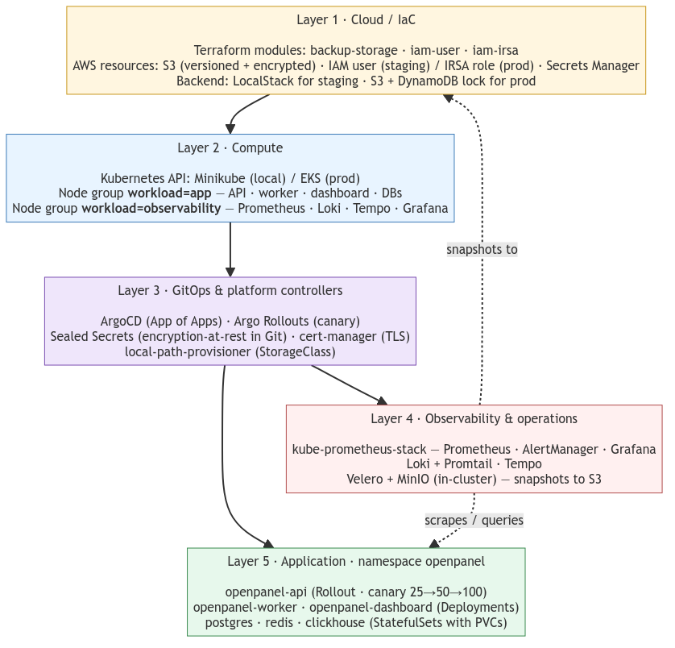

---

### Diseño del Clúster de Kubernetes

El entorno local se ejecuta sobre un clúster Minikube de tres nodos compuesto por:

- Un nodo dedicado al control-plane
- Dos nodos worker

El nodo del control-plane está marcado con un taint para evitar que las cargas de trabajo de la aplicación se programen en él. Los nodos worker están etiquetados según su responsabilidad:

- `workload=app`
- `workload=observability`

Estas etiquetas son utilizadas por las reglas de afinidad de nodo de Kubernetes para separar las cargas de trabajo de la aplicación de los servicios de monitorización y observabilidad. Esta separación mejora el aislamiento de recursos y refleja el mismo modelo de planificación previsto para el entorno AWS EKS.

Las mismas etiquetas de nodo y reglas de afinidad pueden reutilizarse directamente en los node groups de EKS, garantizando una colocación de cargas de trabajo coherente entre los entornos local y cloud.

### Almacenamiento Persistente y Copias de Seguridad

Los servicios stateful del proyecto se configuran con almacenamiento persistente para garantizar que los datos sobrevivan a reinicios de pods, eventos de reprogramación y actualizaciones del clúster.

Los siguientes componentes utilizan volúmenes persistentes:

- PostgreSQL
- ClickHouse
- Redis
- Tempo

La persistencia de Redis se habilita para evitar la pérdida de trabajos en cola en segundo plano, mientras que Tempo almacena trazas en volúmenes persistentes para retener datos de observabilidad entre despliegues y reinicios de pods.

Las operaciones de copia de seguridad y recuperación se gestionan con Velero. Los entornos local y de staging utilizan MinIO como backend de almacenamiento compatible con S3, mientras que el diseño orientado a producción en AWS utiliza Amazon S3 para el almacenamiento de copias de seguridad a largo plazo.

---

#### Módulos de Terraform

| Módulo | Propósito | Utilizado por |
|---|---|---|
| `modules/backup-storage` | Crea el bucket S3 para las copias de seguridad de Velero con versionado, cifrado y restricciones de acceso público, además de un slot en Secrets Manager para la copia de seguridad de la clave RSA de Sealed Secrets | staging + prod |
| `modules/iam-user` | Crea un usuario IAM y una clave de acceso para los entornos de staging y LocalStack | staging |
| `modules/iam-irsa` | Crea un rol IAM con confianza OIDC para las service accounts de EKS | prod |

#### Distribución de Entornos

| Entorno | Backend de Estado | Plataforma Destino |
|---|---|---|
| `environments/staging` | Estado local | LocalStack |
| `environments/prod` | Backend S3 con bloqueo en DynamoDB | AWS |

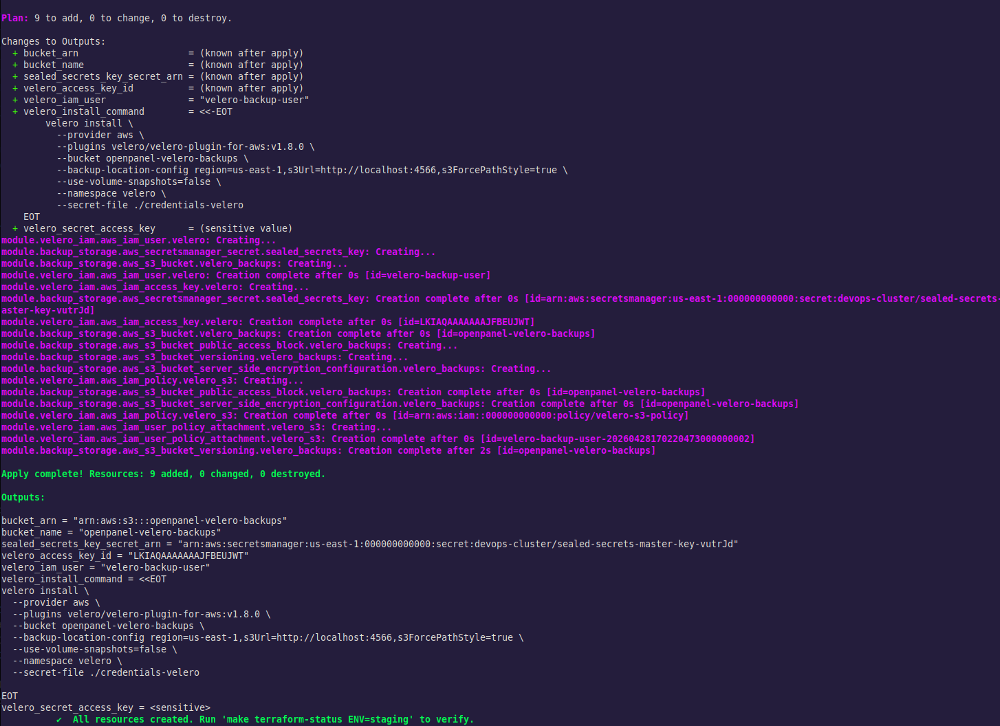

El repositorio se centra intencionalmente en los componentes de infraestructura necesarios para validar el proyecto localmente. Por esta razón, la implementación no aprovisiona un entorno AWS completo de producción con módulos de Terraform para VPCs, clústeres EKS, RDS o ElastiCache.

En su lugar, el proyecto incluye un diseño de arquitectura AWS orientado a producción que demuestra cómo se desplegaría la aplicación en un entorno cloud real. Este diseño incluye:

- Una VPC distribuida en múltiples zonas de disponibilidad
- Subredes públicas y privadas
- Nodos worker de EKS ejecutándose en subredes privadas
- Un Application Load Balancer expuesto públicamente
- RDS para PostgreSQL
- ElastiCache para Redis
- S3 para el almacenamiento de copias de seguridad
- IAM Roles for Service Accounts (IRSA)

---

### Arquitectura Objetivo en AWS

El siguiente diagrama ilustra el modelo de despliegue de producción previsto sobre AWS.

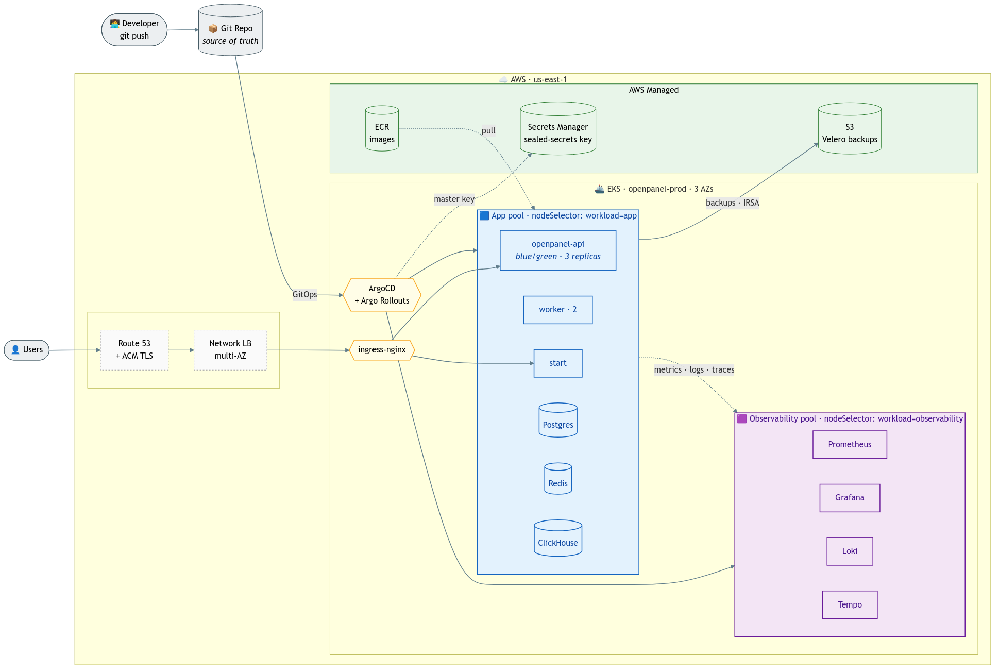


## Estrategia de CI/CD

### Visión General del Pipeline

El proyecto utiliza un flujo de CI/CD basado en GitOps repartido entre dos repositorios:

- El **repositorio de la aplicación**, que contiene el código fuente de OpenPanel y los pipelines de construcción de contenedores.
- El **repositorio de infraestructura**, que contiene los manifiestos de Kubernetes, la configuración de GitOps, los módulos de Terraform y la automatización de la plataforma.

Esta separación mantiene independientes la entrega de la aplicación y la gestión de la infraestructura, al tiempo que permite que ambos pipelines trabajen juntos a través de eventos automatizados.


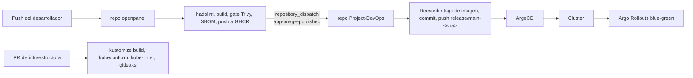
```mermaid
flowchart LR
  Dev[Push del desarrollador] --> AppRepo[repo openpanel]
  AppRepo --> CI1[hadolint, build, gate Trivy, SBOM, push a GHCR]
  CI1 -- repository_dispatch<br/>app-image-published --> Infra[repo Project-DevOps]
  Infra --> Bump[Reescribir tags de imagen, commit, push release/main-&lt;sha&gt;]
  Bump --> ArgoCD --> Cluster --> Rollouts[Argo Rollouts blue-green]
  PR[PR de infraestructura] --> CI2[kustomize build, kubeconform, kube-linter, gitleaks]
```

### Integración Continua

La Integración Continua se divide intencionalmente entre los repositorios de aplicación e infraestructura. El repositorio de OpenPanel cambia con frecuencia porque contiene el código fuente de la aplicación, mientras que el repositorio de infraestructura cambia con menos frecuencia y se centra en la configuración de la plataforma. Mantener los pipelines separados evita reconstrucciones innecesarias de contenedores cuando solo cambia la configuración de infraestructura o de Kubernetes.


### Pipeline de la Aplicación

El pipeline de la aplicación está implementado en `openpanel/.github/workflows/build-publish.yml`.

El workflow realiza las siguientes fases:

1. **Validación del Dockerfile**

    `hadolint` valida todos los Dockerfiles para detectar problemas habituales en la construcción de contenedores y violaciones de las buenas prácticas de Dockerfile.

2. **Construcción de imágenes de contenedor**

    El pipeline construye las imágenes `api`, `worker` y `dashboard` utilizando una estrategia de matriz.

3. **Escaneo de seguridad**

    Trivy escanea las imágenes resultantes en busca de vulnerabilidades. El pipeline falla automáticamente si se detectan vulnerabilidades HIGH o CRITICAL. Los resultados del escaneo se suben a la pestaña Security de GitHub en formato SARIF para simplificar la revisión y el seguimiento de vulnerabilidades.

4. **Generación de SBOM**

    Syft genera un Software Bill of Materials (SBOM) por cada build, proporcionando visibilidad sobre las dependencias y paquetes de la imagen.

5. **Publicación de imágenes de contenedor**

    Las imágenes se publican en GitHub Container Registry (GHCR). El workflow genera tanto tags de versión semántica como tags basados en el commit, como `main-<sha>`.


6. **Disparador de GitOps**

    Tras un push de imagen exitoso, el pipeline envía un evento `repository_dispatch` llamado `app-image-published`. Este evento dispara el workflow del repositorio de infraestructura responsable de actualizar los manifiestos de Kubernetes.

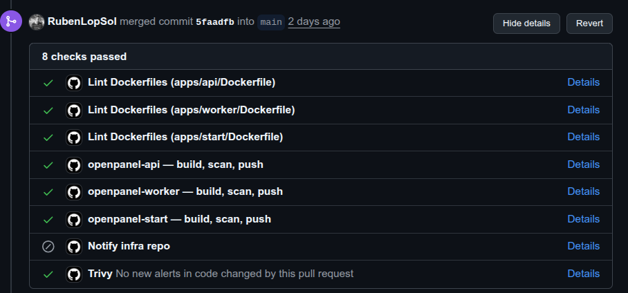
---

### Pipeline de Validación de Infraestructura

El pipeline de validación de infraestructura está implementado en `Project-DevOps/.github/workflows/ci-validate.yml`. El workflow valida los manifiestos de Kubernetes y la configuración de infraestructura antes de que los cambios se mergeen.

El pipeline realiza las siguientes comprobaciones:

1. **Renderizado con Kustomize**

    `kustomize build` se ejecuta para todos los overlays y entornos, incluyendo:

    - Overlays de la aplicación OpenPanel
    - Stack de observabilidad
    - Argo Rollouts
    - cert-manager
    - Velero
    - local-path-provisioner

2. **Validación de esquema de Kubernetes**

    `kubeconform` valida los manifiestos contra la versión de la API de Kubernetes utilizada por el clúster destino.

3. **Validación de buenas prácticas de Kubernetes**

    `kube-linter` detecta problemas habituales de configuración de Kubernetes, incluyendo:

    - Falta de límites de recursos
    - Uso de tags de imagen `latest`
    - Contenedores ejecutándose como root

4. **Escaneo de secretos**

    `gitleaks` escanea los cambios en busca de credenciales o información sensible commiteadas accidentalmente.

  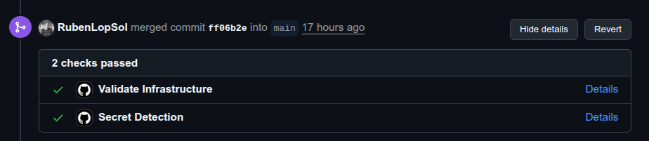
---


### Seguridad y Gestión de Dependencias

Los pipelines de CI siguen varias prácticas orientadas a la seguridad. Todas las herramientas de CI se descargan utilizando verificación de checksum SHA-256, y los workflows de GitHub Actions utilizan permisos mínimos de token por defecto (`read-only`) siempre que sea posible.

Ambos repositorios también utilizan Dependabot para actualizaciones automáticas de dependencias. El repositorio de infraestructura monitoriza:

- Versiones de GitHub Actions
- Providers y módulos de Terraform

El repositorio de la aplicación monitoriza:

- GitHub Actions
- Dependencias npm en todo el workspace pnpm
- Imágenes base de Docker

Las actualizaciones de dependencias se proponen automáticamente mediante pull requests y se validan a través de los mismos workflows de CI utilizados para los cambios habituales de desarrollo.

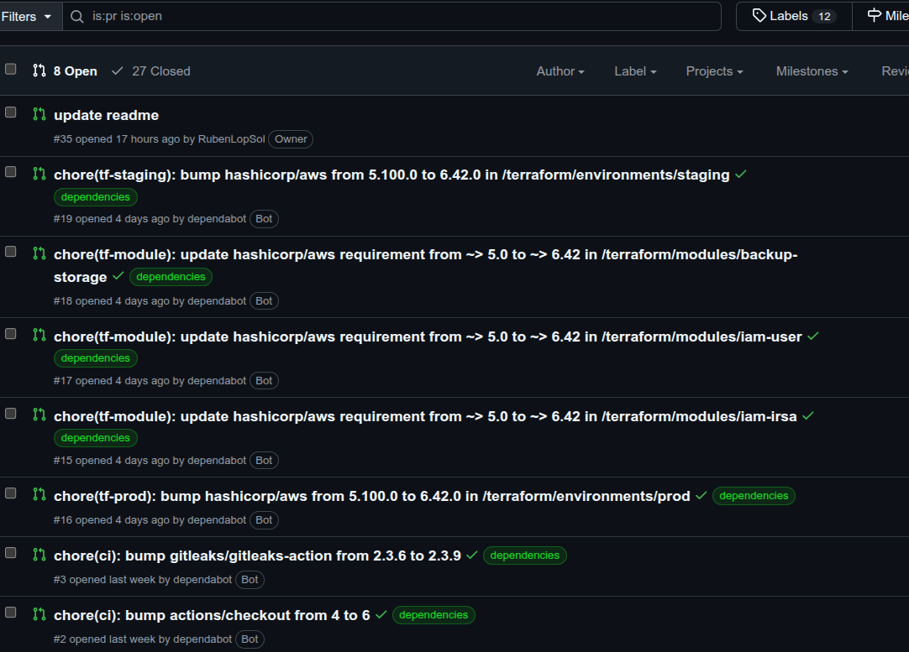

----

### Despliegue Continuo (CD)

El flujo de Despliegue Continuo se implementa a través del pipeline `cd-update-tags.yml` en el repositorio de infraestructura.

Este workflow se dispara automáticamente cuando el repositorio de la aplicación publica una nueva imagen de contenedor y envía el evento `repository_dispatch` `app-image-published`.

Cuando se recibe el evento, el pipeline realiza los siguientes pasos:

1. Lee la versión de la imagen y el SHA del commit incluidos en el payload del evento.
2. Actualiza los tags de imagen referenciados en los manifiestos de Kubernetes.
3. Commitea los manifiestos actualizados de vuelta al repositorio de infraestructura.
4. Crea un tag de Git con el formato: `release/main-<sha>`

ArgoCD está configurado para monitorizar estos tags de release. Durante el siguiente ciclo de sincronización, detecta los manifiestos actualizados y aplica el nuevo estado deseado al clúster de Kubernetes.

Este enfoque mantiene los despliegues totalmente dirigidos por Git, garantizando que el repositorio Git siga siendo la fuente única de verdad para el estado de la plataforma.

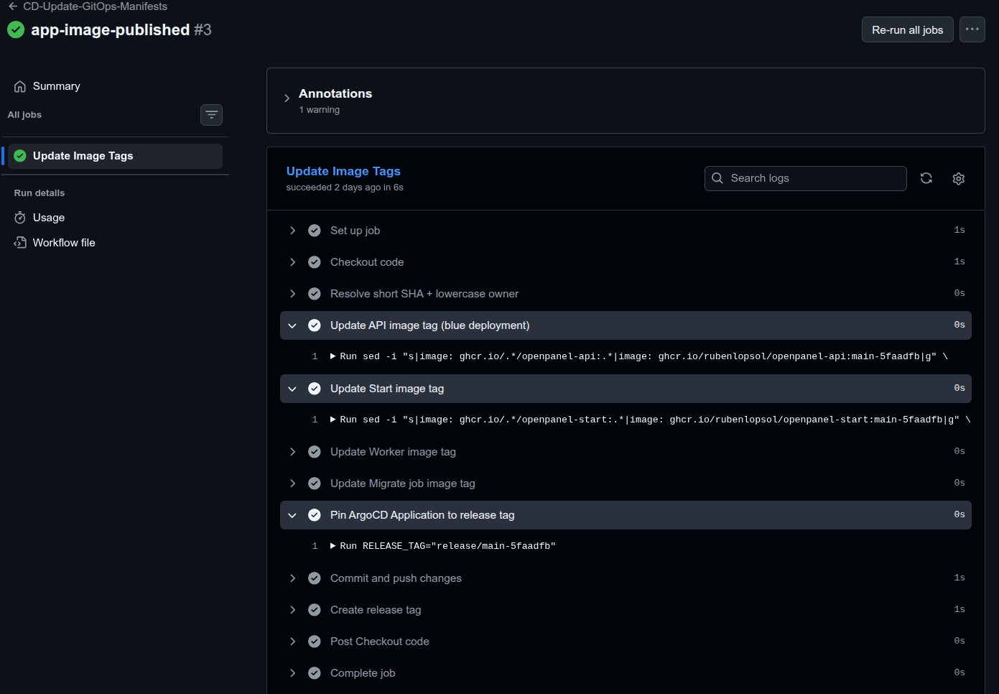

---

### Entrega Progresiva con Argo Rollouts

El despliegue de la aplicación dentro del clúster es gestionado por Argo Rollouts en lugar de los Deployments estándar de Kubernetes.

El servicio API se ejecuta como un recurso `Rollout` de Argo Rollouts utilizando una estrategia de despliegue blue-green. Cuando se despliega una nueva versión de la aplicación, Argo Rollouts crea un nuevo ReplicaSet junto a la versión actualmente activa.

La nueva versión se expone a través de un servicio de preview dedicado: `openpanel-api-preview`, mientras que el tráfico de producción sigue utilizando `openpanel-api`.

Esta separación permite validar la nueva release antes de que el tráfico se conmute hacia ella.

La promoción automática está intencionalmente deshabilitada: `autoPromotionEnabled: false`.

Esto convierte el paso final de promoción en manual, permitiendo ejecutar pruebas de humo y comprobaciones de validación contra la versión de preview antes de exponerla a los usuarios.

La configuración del rollout también mantiene el ReplicaSet anterior funcionando durante un tiempo limitado tras la promoción:

```yaml
scaleDownDelaySeconds: 600
```

Esto mejora la velocidad de rollback porque la versión anterior permanece disponible y no necesita escalar de nuevo si se requiere un rollback.

Las revisiones anteriores también se conservan utilizando:

```yaml
revisionHistoryLimit: 3
```

lo que simplifica la recuperación ante despliegues fallidos.

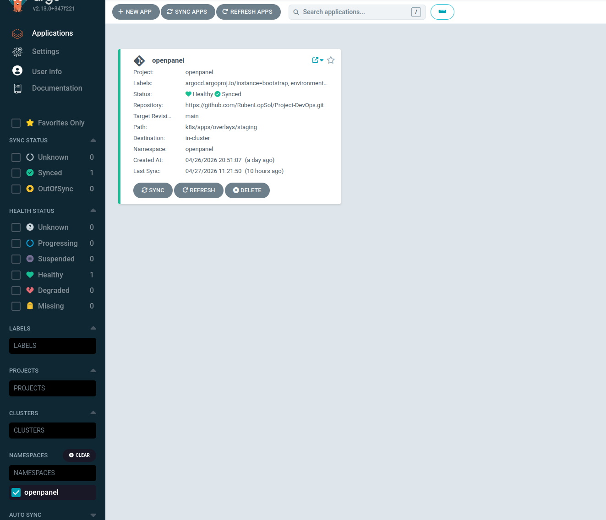
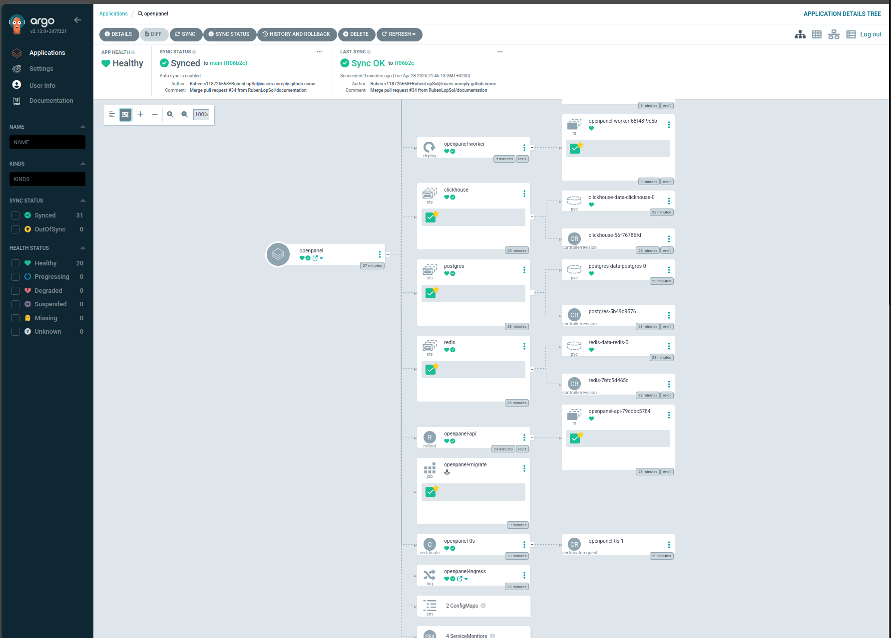
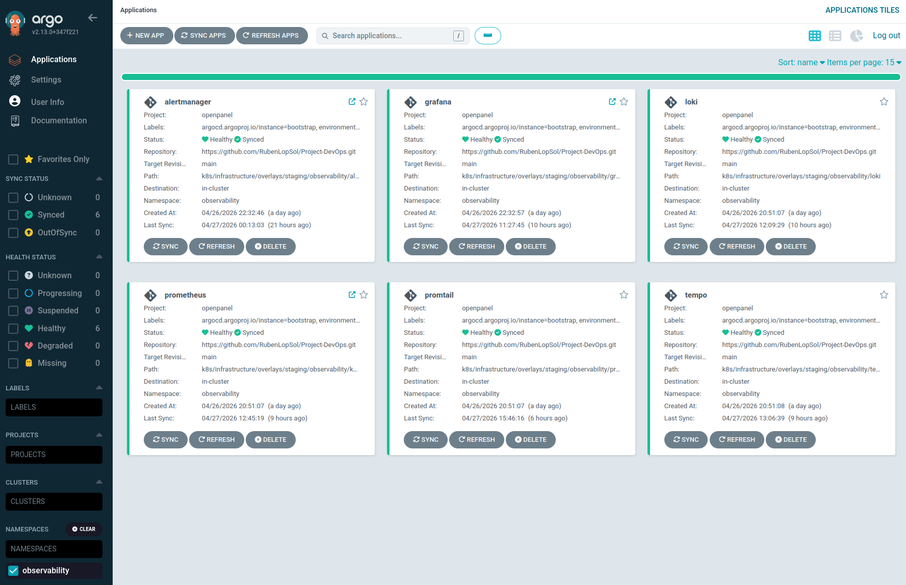


---

### Configuración de Entornos

La implementación local no utiliza un clúster de Kubernetes de staging dedicado. En su lugar, la separación de entornos se gestiona mediante overlays de Kustomize.

El proyecto define overlays separados para los entornos `staging` y `prod` utilizando [Kustomize](https://kustomize.io/). Ambos overlays reutilizan los mismos manifiestos base de Kubernetes mientras aplican cambios de configuración específicos de cada entorno.

Esta estructura refleja cómo se gestionarían normalmente múltiples instancias de ArgoCD o clústeres de Kubernetes en un entorno cloud de producción, manteniendo al mismo tiempo la implementación local ligera y reproducible.


---

## Observabilidad

La observabilidad se diseñó como una parte central de la plataforma. El objetivo no era solo recopilar métricas y logs, sino también proporcionar suficiente visibilidad para entender el comportamiento de la aplicación, diagnosticar fallos y validar despliegues en tiempo real.

El stack combina métricas, logs, trazas, dashboards y alertas en una única plataforma de monitorización integrada directamente en Kubernetes.


### Stack de Observabilidad

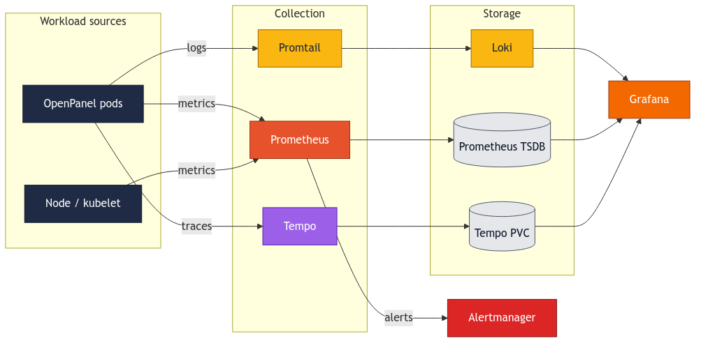

| Pilar | Herramienta | Propósito |
|---|---|---|
| Métricas | Prometheus | Recogida de métricas y monitorización |
| Logs | Loki + Promtail | Agregación centralizada de logs |
| Trazas | Tempo | Trazado distribuido |
| Dashboards | Grafana | Visualización y dashboards operacionales |
| Alertas | Alertmanager | Enrutado de alertas y gestión de notificaciones |

El stack de observabilidad se despliega dentro del clúster de Kubernetes utilizando una combinación de:

- `kube-prometheus-stack`
- Loki
- Promtail
- Tempo
- Grafana
- Alertmanager

Promtail se ejecuta como un DaemonSet en cada nodo y reenvía los logs de los contenedores a Loki. Grafana se configura automáticamente mediante ConfigMaps y descubrimiento por sidecar, permitiendo aprovisionar dashboards sin importaciones manuales.

Tempo utiliza almacenamiento persistente para retener trazas entre reinicios de pods, mientras que Alertmanager está configurado para enrutar alertas a Slack y, opcionalmente, a PagerDuty en el diseño orientado a producción.

---
### Recogida de Métricas

La plataforma recoge métricas de tres áreas principales:

- Servicios de aplicación
- Almacenes de datos
- Infraestructura de Kubernetes

#### Métricas de Aplicación

Para cada servicio de OpenPanel, se recogen las siguientes métricas:

- Tasa de peticiones
- Tasa de errores
- Latencia P95 y P99
- Lag del event loop de Node.js
- Profundidad de cola a través del exporter de Redis

Estas métricas proporcionan visibilidad sobre la capacidad de respuesta de la API, el throughput del worker y el procesamiento de trabajos en segundo plano.

#### Métricas de Bases de Datos y Colas

La capa de datos exporta métricas operativas a través de exporters dedicados:

| Servicio | Exporter | Métricas |
|---|---|---|
| PostgreSQL | `postgres_exporter` | Conexiones activas, estadísticas de consultas |
| Redis | `redis_exporter` | Uso de memoria, métricas de cola |
| ClickHouse | Endpoint Prometheus integrado (puerto 9363) | Tamaños de tabla, tasas de inserción, recuentos de filas |

#### Métricas de Kubernetes

Las métricas a nivel de clúster se recogen mediante `kube-state-metrics` y `node-exporter`.

Estas incluyen:

- Uso de CPU y memoria por pod
- Estado del ciclo de vida de los pods
- Recuento de reinicios
- Utilización de volúmenes persistentes
- Presión de recursos en los nodos
- Uso de disco

En conjunto, estas métricas proporcionan visibilidad tanto sobre la salud de la aplicación como sobre la estabilidad del clúster de Kubernetes.

---

### Logging y Trazado

Los logs de los contenedores son recopilados por Promtail y reenviados a Loki con etiquetas que incluyen:

- `namespace`
- `app`
- `pod`
- `container`

Esta estructura de etiquetas facilita filtrar y correlacionar logs entre servicios.

El trazado distribuido se implementa con Tempo y se integra en Grafana. Cuando una línea de log contiene un `traceID`, Grafana genera automáticamente un enlace a la traza distribuida correspondiente.
Esta integración simplifica significativamente la resolución de problemas durante fallos e investigaciones de rendimiento.

---

### Estrategia de Alertas

El proyecto implementa alertas tanto para la propia aplicación como para el stack de observabilidad. Las alertas se dividen en dos grupos:

- Alertas de aplicación e infraestructura
- Alertas de auto-monitorización de Alertmanager

---

### Alertas de Aplicación e Infraestructura

| Alerta | Condición | Duración | Severidad |
|---|---|---|---|
| `APIDown` | API no disponible | 2 min | critical |
| `HighErrorRate` | Las respuestas 5xx superan el 5% | 5 min | critical |
| `APIHighLatency` | La latencia P99 supera los 2s | 5 min | warning |
| `NodeJSEventLoopLag` | El lag del event loop supera los 500ms | 5 min | warning |
| `HighMemoryUsage` | La memoria del contenedor supera el 90% del límite | 5 min | warning |
| `PostgresDown` | PostgreSQL no disponible | 2 min | critical |
| `RedisDown` | Redis no disponible | 2 min | critical |

---

### Auto-Monitorización de Alertmanager

| Alerta | Condición | Duración | Severidad |
|---|---|---|---|
| `AlertmanagerDown` | Alertmanager no disponible | 5 min | critical |
| `AlertmanagerFailedReload` | La recarga de configuración ha fallado | 10 min | warning |
| `AlertmanagerNotificationFailures` | Se han detectado fallos en la entrega de notificaciones | 5 min | warning |

---

### Enrutado de Alertas y Gestión de Notificaciones

Alertmanager se configura de forma independiente del stack principal de Prometheus para simplificar los cambios de enrutado y las pruebas de notificación.
Una vez que una alerta se dispara y supera su ventana de umbral configurada, Prometheus la reenvía a Alertmanager, que decide entonces cómo debe enrutarse la notificación.
La configuración de enrutado agrupa las alertas por: `alertname`, `namespace`, `severity`.


#### Receptores de Notificaciones

El proyecto utiliza actualmente Slack como canal principal de notificaciones.

| Receptor | Propósito |
|---|---|
| Slack | Notificaciones operacionales de alertas |
| PagerDuty | Receptor previsto para escalado en el diseño orientado a producción |


Las notificaciones de Slack se envían a un canal de alertas dedicado e incluyen las notificaciones de resolución para proporcionar visibilidad completa del ciclo de vida de la alerta. PagerDuty se incluye en el diseño orientado a producción como receptor adicional para alertas críticas que requieran escalado fuera del horario laboral normal.

---

### Dashboards de Grafana

Se crearon tres dashboards personalizados de Grafana específicamente para el proyecto. Los dashboards se almacenan como ficheros JSON dentro del directorio: `grafana-dashboards`.
Grafana carga automáticamente estos dashboards mediante descubrimiento por sidecar durante el arranque del clúster.

#### Dashboard de OpenPanel

El dashboard de la aplicación se centra en métricas a nivel de servicio.

  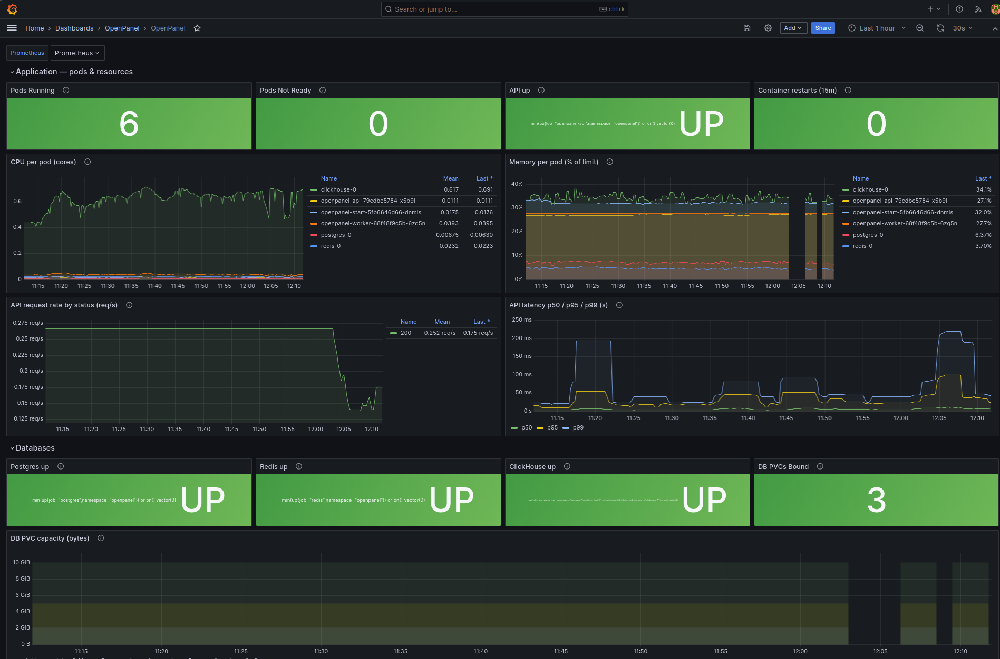

---

#### Dashboard del Clúster

El dashboard del clúster proporciona visibilidad a nivel de infraestructura sobre el entorno Kubernetes.

  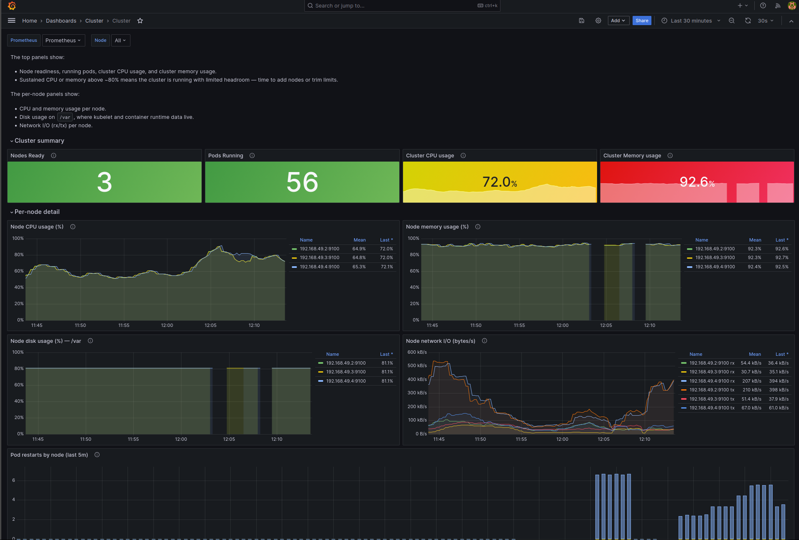

---

#### Dashboard de Logs y Trazas

Este dashboard combina los logs de Loki y las trazas de Tempo en una única vista de resolución de problemas.
Una entrada de log que contenga un `traceID` puede abrirse directamente en Tempo desde Grafana, permitiendo una correlación rápida entre logs y trazas distribuidas.

  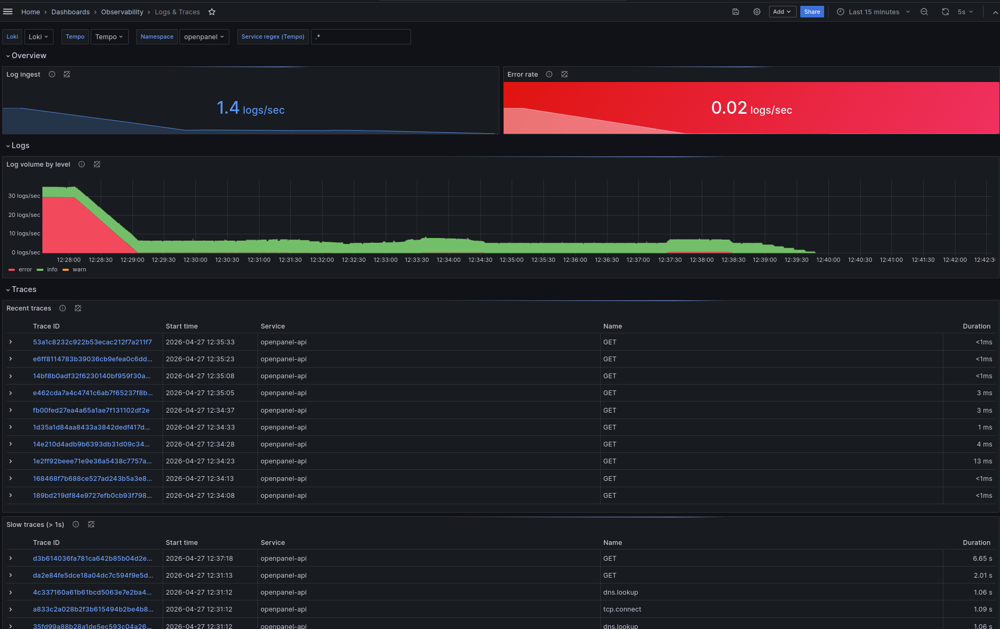

---

### Interfaz de Alertmanager

La siguiente captura de pantalla muestra Alertmanager gestionando alertas activas y enrutándolas según las reglas de notificación configuradas.

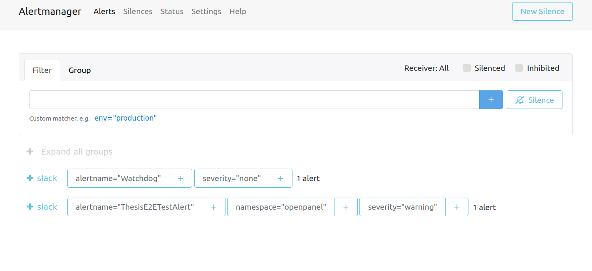

---

## Estrategia de Seguridad

La seguridad se integró en el proyecto. El enfoque general combina los principios de GitOps con la gestión segura de secretos, la entrega progresiva, el aislamiento de la infraestructura y la validación automatizada dentro del pipeline de CI/CD.
La plataforma se centra en tres áreas principales:

- Manejo seguro de secretos
- Protección de copias de seguridad y recuperación


### Gestión de Secretos

El proyecto utiliza Bitnami Sealed Secrets para gestionar la información sensible de forma segura dentro de un flujo GitOps.

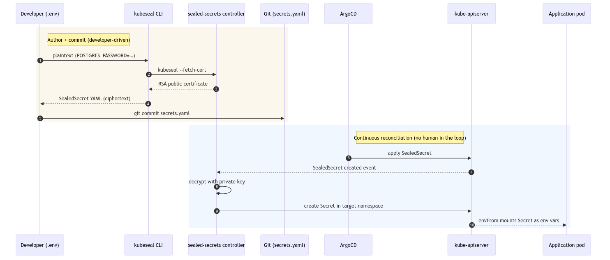

Los manifiestos `Secret` tradicionales de Kubernetes no pueden almacenarse de forma segura en repositorios Git porque contienen datos sensibles en texto plano. Sealed Secrets resuelve este problema cifrando los secretos antes de que se commiteen en Git.
Dentro del clúster, el controlador de Sealed Secrets descifra estos recursos de vuelta a objetos `Secret` nativos de Kubernetes. El controlador se ejecuta con una clave de cifrado RSA-4096 generada automáticamente durante la configuración del clúster. La clave privada se respalda localmente en `~/.config/openpanel/sealing-key.yaml`. Esta copia de seguridad permite reconstruir el clúster de Kubernetes sin invalidar los manifiestos `SealedSecret` cifrados ya almacenados en Git.


### Flujo de Gestión de Secretos

El proyecto incluye varios scripts auxiliares para automatizar la gestión de secretos:

| Script | Propósito |
|---|---|
| `ensure-sealing-key.sh` | Genera o restaura el par de claves de Sealed Secrets |
| `reseal-secrets.sh` | Vuelve a cifrar secretos en texto plano en manifiestos `SealedSecret` |
| `stabilize-secrets.sh` | Verifica que todos los Secrets de Kubernetes se han creado correctamente tras el despliegue |

Estos scripts se integran en el proceso de bootstrap del clúster para garantizar que los secretos permanezcan sincronizados y reproducibles entre entornos.


#### Proceso de Bootstrap del Clúster

Durante la inicialización del clúster, la sealing key almacenada se restaura antes de que las aplicaciones de ArgoCD se sincronicen. Esto garantiza que los secretos cifrados previamente sigan siendo válidos tras reconstruir el clúster.

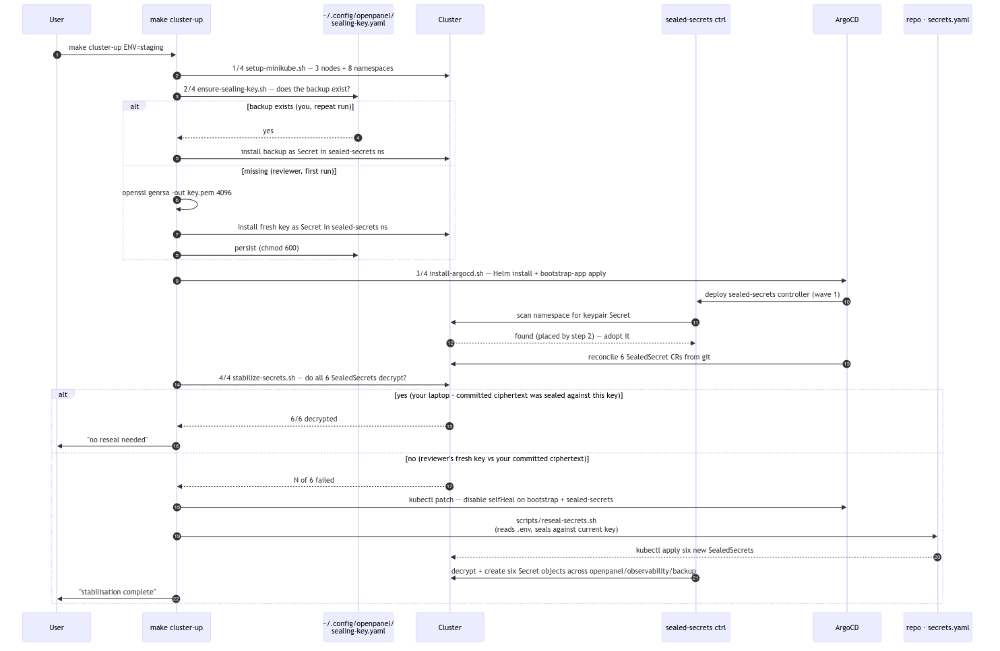


### Migración Futura al External Secrets Operator

Para un despliegue AWS orientado a producción, el enfoque preferido a largo plazo sería sustituir Sealed Secrets por el External Secrets Operator (ESO) integrado con AWS Secrets Manager.

Este diseño ya se ha contemplado en el proyecto. El flujo de GitOps permanecería sin cambios, ya que los manifiestos `ExternalSecret` seguirían gestionándose mediante Git y se sincronizarían a través de ArgoCD.

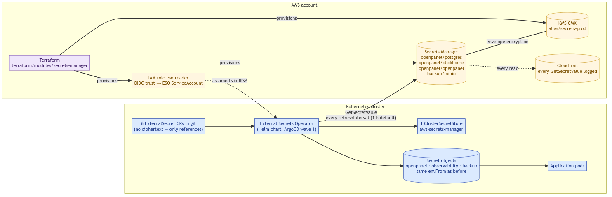

## TLS y Gestión de Certificados

Los certificados TLS se gestionan mediante cert-manager.

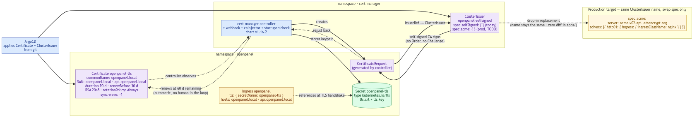

cert-manager automatiza:

- La emisión de certificados
- La renovación de certificados
- La creación de secretos TLS de Kubernetes
- La integración de certificados con Ingress

Esto elimina la necesidad de gestionar manualmente los certificados TLS y simplifica la exposición segura de servicios dentro del clúster.

---

## Validación de Seguridad en CI/CD

La validación de seguridad se integra directamente en los workflows de CI/CD.

Los pipelines incluyen:

- Escaneo de vulnerabilidades con Trivy
- Detección de secretos con Gitleaks
- Validación con kube-linter
- Aplicación obligatoria de contenedores no root
- NetworkPolicies de Kubernetes

Estas comprobaciones ayudan a evitar que los problemas de seguridad habituales lleguen al clúster, manteniendo el proceso de despliegue totalmente automatizado y reproducible.

---


## Copias de Seguridad y Recuperación ante Desastres

El proyecto incluye una estrategia de copia de seguridad y recuperación basada en Velero junto con almacenamiento de objetos compatible con S3. El mismo flujo de copia de seguridad se utiliza en todos los entornos, mientras que el backend de almacenamiento cambia según el destino del despliegue. Se admiten dos modelos de almacenamiento:

- MinIO para los entornos local y de staging
- Amazon S3 para el diseño de producción orientado a AWS

La estrategia de copia de seguridad está diseñada para proteger tanto los recursos de Kubernetes como los datos de la aplicación, permitiendo recuperar la plataforma tras fallos, eliminaciones accidentales o reconstrucciones del clúster.

---

### Alcance de las Copias de Seguridad

Este proyecto utiliza dos capas complementarias de copia de seguridad:

#### Copias de Seguridad de Recursos de Kubernetes

Velero es responsable de hacer copia de seguridad de los recursos de Kubernetes, incluyendo:

- Deployments
- Services
- ConfigMaps
- Secrets
- Metadatos de volúmenes persistentes

Estas copias de seguridad permiten restaurar el estado de Kubernetes de la plataforma en un nuevo clúster.

#### Copias de Seguridad de Datos de Aplicación

Los servicios stateful se respaldan de forma independiente utilizando los mecanismos nativos de copia de seguridad de cada base de datos:

| Servicio | Método de Copia de Seguridad |
|---|---|
| PostgreSQL | Exportación de base de datos con `pg_dump` |
| Redis | Snapshot RDB |
| ClickHouse | Copia de seguridad nativa de la base de datos |

Esta separación mantiene independientes y más fáciles de gestionar la recuperación de la infraestructura y la recuperación de los datos de aplicación.

---

### Flujo de Copia de Seguridad — Staging

Los entornos local y de staging utilizan MinIO como backend de almacenamiento compatible con S3 ejecutándose dentro del clúster de Kubernetes.

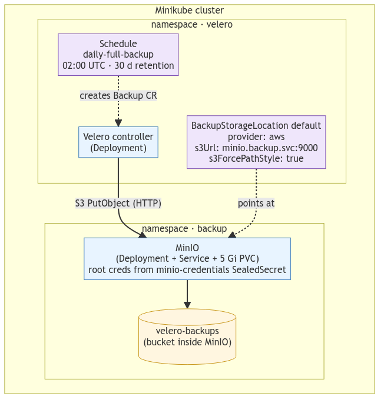
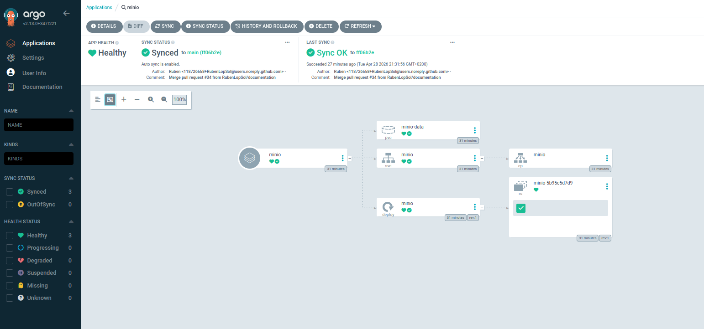
---

### Flujo de Copia de Seguridad — Producción

El diseño orientado a producción en AWS utiliza Amazon S3 como backend de almacenamiento de copias de seguridad.

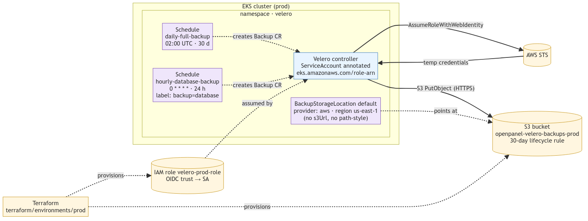

El diseño de producción utiliza IRSA (IAM Roles for Service Accounts) para permitir que Velero se autentique con AWS de forma segura sin almacenar credenciales cloud estáticas dentro del clúster.

---

### Programación de Copias de Seguridad

Las copias de seguridad automatizadas se configuran mediante schedules de Velero.

| Schedule | Frecuencia | Entorno |
|---|---|---|
| `daily-full-backup` | Diaria | staging + prod |
| `hourly-database-backup` | Horaria | prod |

---

### Operaciones de Copia de Seguridad y Restauración

Todas las operaciones de copia de seguridad y restauración se gestionan mediante `scripts/backup-restore.sh`

Comandos de ejemplo:

```bash
# Crear una copia de seguridad de Velero
./scripts/backup-restore.sh backup

# Crear copias de seguridad de bases de datos
./scripts/backup-restore.sh backup-db

# Listar las copias de seguridad disponibles
./scripts/backup-restore.sh list
```

Las operaciones de restauración se realizan utilizando:

```bash
./scripts/backup-restore.sh restore <nombre-de-la-copia>
```

Velero restaura los recursos de Kubernetes almacenados en la copia de seguridad, mientras que las copias de seguridad de bases de datos pueden restaurarse por separado cuando sea necesario.

---

### Recuperación ante Desastres

Velero es responsable de:

- Copias de seguridad de recursos de Kubernetes
- Copias de seguridad de snapshots de volúmenes persistentes
- Operaciones de restauración
- Flujos de recuperación ante desastres

Este enfoque permite reconstruir la plataforma y recuperar el estado de la aplicación tras fallos de infraestructura o recreación del clúster.

---


## Referencias

### Aplicación

- OpenPanel — https://github.com/Openpanel-dev/openpanel
- Documentación de OpenPanel — https://docs.openpanel.dev
- Prisma migrate como hook de Kubernetes — https://www.prisma.io/docs/orm/prisma-migrate

### GitOps y entrega progresiva

- ArgoCD — https://argo-cd.readthedocs.io/
- App-of-Apps — https://argo-cd.readthedocs.io/en/stable/operator-manual/cluster-bootstrapping/
- Argo Rollouts — https://argoproj.github.io/argo-rollouts/
- Sealed Secrets — https://github.com/bitnami-labs/sealed-secrets
- External Secrets Operator — https://external-secrets.io/

### CI/CD y cadena de suministro

- GitHub Actions — https://docs.github.com/actions
- `docker/metadata-action` — https://github.com/docker/metadata-action
- Trivy — https://trivy.dev
- Syft — https://github.com/anchore/syft
- hadolint — https://github.com/hadolint/hadolint
- kubeconform — https://github.com/yannh/kubeconform
- kube-linter — https://docs.kubelinter.io/
- gitleaks — https://github.com/gitleaks/gitleaks

### Observabilidad

- kube-prometheus-stack — https://github.com/prometheus-community/helm-charts/tree/main/charts/kube-prometheus-stack
- Loki — https://grafana.com/docs/loki/latest/
- Tempo — https://grafana.com/docs/tempo/latest/
- Alertas en Prometheus — https://prometheus.io/docs/practices/alerting/

### Infraestructura y copias de seguridad

- Provider AWS de Terraform — https://registry.terraform.io/providers/hashicorp/aws/latest
- Velero — https://velero.io/
- IAM Roles for Service Accounts (IRSA) — https://docs.aws.amazon.com/eks/latest/userguide/iam-roles-for-service-accounts.html
- LocalStack — https://docs.localstack.cloud/

### Repositorios de referencia

- `argoproj/argocd-example-apps` — https://github.com/argoproj/argocd-example-apps
- `prometheus-operator/kube-prometheus` — https://github.com/prometheus-operator/kube-prometheus
