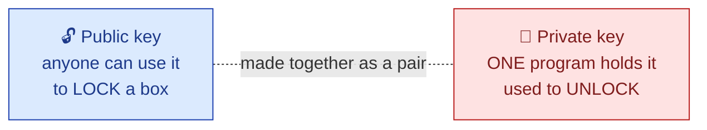
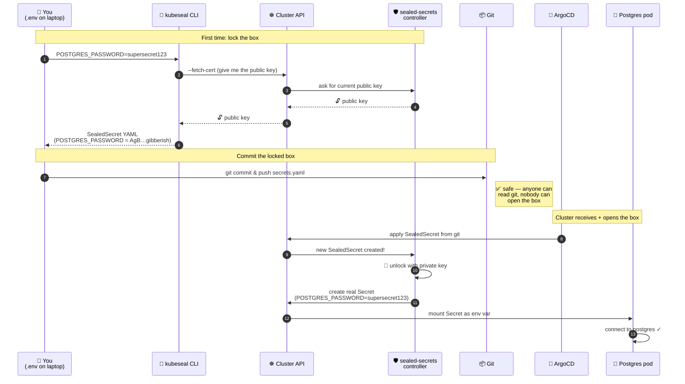
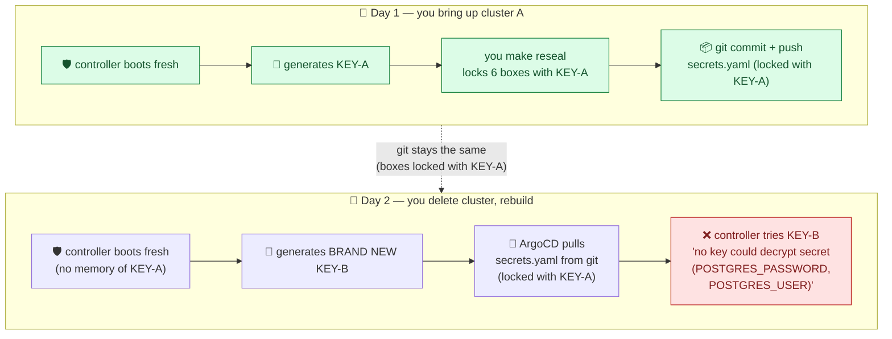
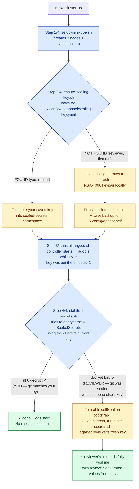
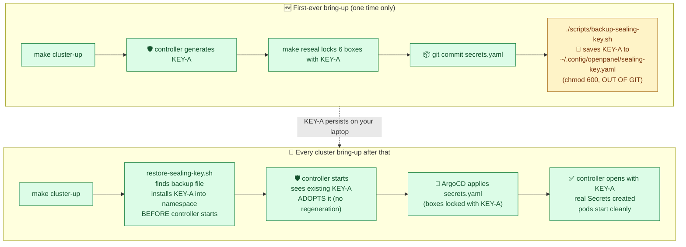
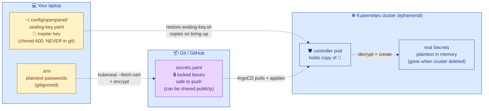
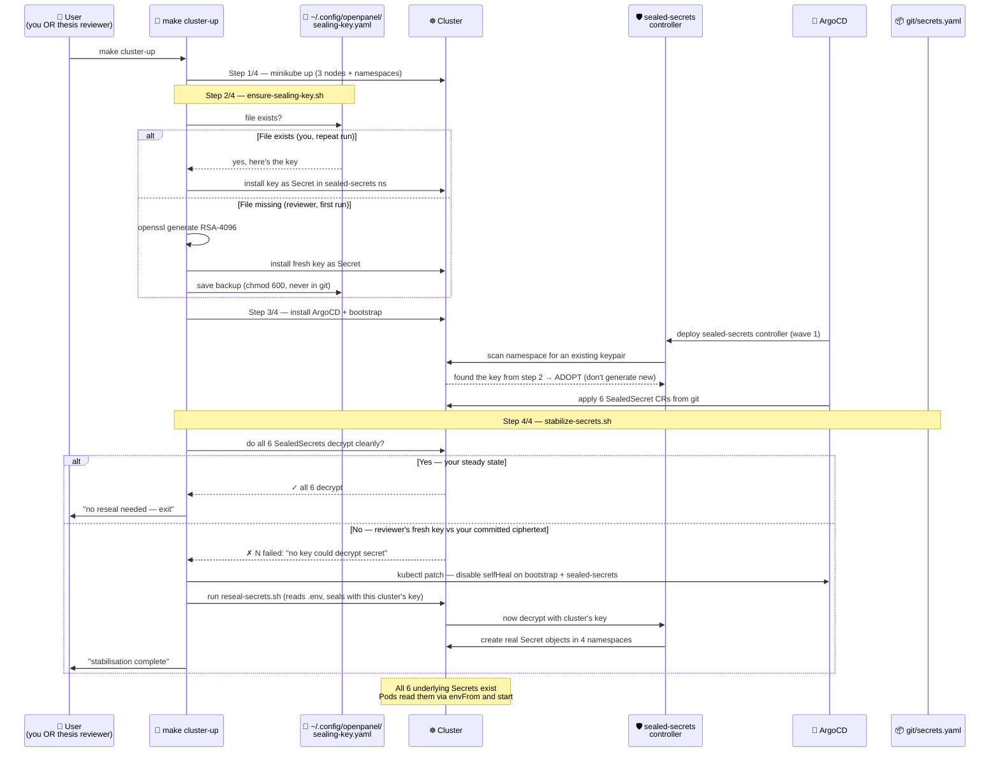
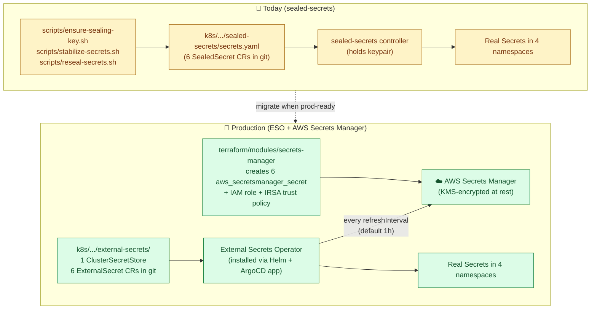

# Sealed Secrets

---

## Directory layout

```
base/sealed-secrets/
├── kustomization.yaml     ← Helm chart definition (chart, version, repo, releaseName)
└── values.yaml            ← Common Helm values shared by all environments

overlays/staging/sealed-secrets/
├── kustomization.yaml     ← re-declares chart + adds secrets.yaml resource + staging labels
└── secrets.yaml           ← encrypted SealedSecret manifests (safe to commit)

overlays/prod/sealed-secrets/
├── kustomization.yaml     ← re-declares chart + adds secrets.yaml resource + prod labels
└── secrets.yaml           ← encrypted SealedSecret manifests (sealed with prod key)
```

---

## Resources created

`make sealed-secrets ENV=staging` runs in two passes. ArgoCD does the same in one sync because it handles CRDs before custom resources automatically.

### Pass 1 — controller (base overlay, no `secrets.yaml`)

The Helm chart is rendered with `includeCRDs: true` so the CRD comes out first.
`kubectl apply` processes resources in kind order: CRD → ServiceAccount → Roles → Deployment.

| Kind | Name | Namespace | Purpose |
|---|---|---|---|
| `CustomResourceDefinition` | `sealedsecrets.bitnami.com` | cluster-wide | Registers the `SealedSecret` kind — **must exist before pass 2** |
| `ServiceAccount` | `sealed-secrets` | `sealed-secrets` | Pod identity used by the controller |
| `Role` | `sealed-secrets-key-admin` | `sealed-secrets` | Read/write the RSA key Secret in its own namespace |
| `Role` | `sealed-secrets-service-proxier` | `sealed-secrets` | Allow metrics service proxy |
| `ClusterRole` | `secrets-unsealer` | cluster-wide | Read SealedSecrets + write plain Secrets across all namespaces |
| `RoleBinding` | `sealed-secrets-key-admin` | `sealed-secrets` | Binds key-admin Role to ServiceAccount |
| `RoleBinding` | `sealed-secrets-service-proxier` | `sealed-secrets` | Binds proxier Role to ServiceAccount |
| `ClusterRoleBinding` | `sealed-secrets` | cluster-wide | Binds secrets-unsealer ClusterRole to ServiceAccount |
| `Service` | `sealed-secrets` | `sealed-secrets` | Port 8080 — certificate endpoint (`kubeseal --fetch-cert`) |
| `Service` | `sealed-secrets-metrics` | `sealed-secrets` | Port 8081 — Prometheus metrics scrape endpoint |
| `Deployment` | `sealed-secrets` | `sealed-secrets` | Controller pod — holds the RSA private key and watches for SealedSecrets |

After pass 1, the Makefile waits for two conditions before continuing:
1. `kubectl wait --for=condition=Established crd/sealedsecrets.bitnami.com` — CRD accepted by API server
2. `kubectl wait --for=condition=ready pod -l app.kubernetes.io/name=sealed-secrets` — controller running

The controller generates a fresh RSA key pair on first boot and stores it as:

| Kind | Name | Namespace | Purpose |
|---|---|---|---|
| `Secret` | `sealed-secrets-key<suffix>` | `sealed-secrets` | RSA private key — auto-generated, never written to disk or Git |

### Pass 2 — SealedSecret resources (env overlay)

Once the CRD is registered and the controller is ready, the full overlay is applied.
This includes the Helm chart resources again (idempotent — all `configured`) plus the six `SealedSecret` objects from `secrets.yaml`.

The controller immediately decrypts each `SealedSecret` and creates a plain `Secret` in the target namespace:

| `SealedSecret` name | Target namespace | Plain `Secret` keys | Consumed by |
|---|---|---|---|
| `postgres-credentials` | `openpanel` | `POSTGRES_USER`, `POSTGRES_PASSWORD` | PostgreSQL, OpenPanel app |
| `redis-credentials` | `openpanel` | `REDIS_PASSWORD` | Redis, OpenPanel app |
| `clickhouse-credentials` | `openpanel` | `CLICKHOUSE_USER`, `CLICKHOUSE_PASSWORD` | ClickHouse, OpenPanel app |
| `openpanel-secrets` | `openpanel` | `DATABASE_URL`, `DATABASE_URL_DIRECT`, `CLICKHOUSE_URL`, `REDIS_URL`, `API_SECRET` | OpenPanel app |
| `grafana-admin-credentials` | `observability` | `admin-user`, `admin-password` | Grafana |
| `minio-credentials` | `backup` | `MINIO_ROOT_USER`, `MINIO_ROOT_PASSWORD` | MinIO |

---

## Component and dependency diagram

```
  Git repository
  ┌──────────────────────────────────────────────────┐
  │  base/sealed-secrets/                            │
  │  └── kustomization.yaml (includeCRDs: true)      │
  │                                                  │
  │  overlays/<env>/sealed-secrets/                  │
  │  ├── kustomization.yaml (includeCRDs: true)      │
  │  └── secrets.yaml  ← encrypted, safe to commit   │
  └────────┬─────────────────────┬───────────────────┘
           │ PASS 1              │ PASS 2
           │ kustomize build     │ kustomize build
           │ base/               │ overlays/<env>/
           ▼                     ▼
  ┌──────────────────────────────────────────────────────────────────────────┐
  │  Kubernetes cluster                                                      │
  │                                                                          │
  │  cluster-wide                                                            │
  │  ┌───────────────────────────────────────────────────────────────────┐   │
  │  │  CRD: sealedsecrets.bitnami.com   ← applied first (PASS 1)       │   │
  │  │  ClusterRole: secrets-unsealer                                    │   │
  │  │  ClusterRoleBinding: sealed-secrets                               │   │
  │  └───────────────────────────────────────────────────────────────────┘   │
  │                           ↓ wait: CRD Established                        │
  │  sealed-secrets namespace                                                │
  │  ┌───────────────────────────────────────────────────────────────────┐   │
  │  │  ServiceAccount + Roles + RoleBindings                            │   │
  │  │  Services: sealed-secrets (:8080) + sealed-secrets-metrics (:8081)│   │
  │  │  Deployment: sealed-secrets  ← controller pod                    │   │
  │  │  └── on first boot: generates RSA key pair                       │   │
  │  │      Secret: sealed-secrets-key<hash>  (private key)             │   │
  │  │               ▲ backup-sealing-key   ▼ restore-sealing-key       │   │
  │  └───────────────┼───────────────────────────────────────────────────┘   │
  │                  │          ↓ wait: pod Ready                            │
  │                  │                                                        │
  │                  │   PASS 2: SealedSecret objects applied                │
  │                  │   controller watches for SealedSecrets,               │
  │                  │   decrypts with private key, creates plain Secrets    │
  │                  │                                                        │
  │         ┌────────┴────────────────────────────┐                          │
  │         ▼                                     ▼                          │
  │  openpanel namespace               observability namespace               │
  │  ┌─────────────────────────┐       ┌──────────────────────────┐          │
  │  │  Secret: postgres-creds │       │  Secret: grafana-admin-  │          │
  │  │  Secret: redis-creds    │       │          credentials      │          │
  │  │  Secret: clickhouse-    │       └────────────┬─────────────┘          │
  │  │          creds          │                    ▼                        │
  │  │  Secret: openpanel-     │             Grafana pod (envFrom)           │
  │  │          secrets        │                                             │
  │  └───────────┬─────────────┘       backup namespace                     │
  │              ▼                     ┌──────────────────────────┐          │
  │    OpenPanel pods (envFrom)        │  Secret: minio-creds      │          │
  │    postgres / redis / clickhouse   └────────────┬─────────────┘          │
  │                                                 ▼                        │
  │                                          MinIO pod (envFrom)             │
  └──────────────────────────────────────────────────────────────────────────┘

  AWS Secrets Manager (LocalStack in staging / real AWS in prod)
  ┌────────────────────────────────────────────┐
  │  devops-cluster/sealed-secrets-master-key  │
  │  (full RSA key Secret YAML — for DR only)  │
  └────────────────────────────────────────────┘
          ▲                         │
          │ make backup-sealing-key │ make restore-sealing-key
          └─────────────────────────┘
```

---

## Install dependency order

```
1. make cluster
   └── creates namespace 'sealed-secrets' (wave-0 namespaces)
       make sealed-secrets checks for this and exits early if missing

2. make terraform-infra ENV=staging
   └── provisions the Secrets Manager slot used by make backup-sealing-key

3. make sealed-secrets ENV=staging
   │
   ├── ensure-kustomize
   │   └── auto-installs kustomize v5.4.3 to ~/.local/bin if not found
   │
   ├── PASS 1: kustomize build base/sealed-secrets | kubectl apply
   │   ├── includeCRDs: true → CRD rendered by helm template --include-crds
   │   ├── CRD applied first (kubectl sorts by kind)
   │   ├── then: ServiceAccount, Roles, ClusterRole, Services, Deployment
   │   └── controller pod starts → generates RSA key pair → stores as Secret
   │
   ├── kubectl wait CRD Established   (blocks until API server accepts SealedSecret kind)
   ├── kubectl wait pod Ready         (blocks until controller can decrypt)
   │
   ├── make reseal-secrets (first time only — secrets.yaml does not exist yet)
   │   ├── kubeseal --fetch-cert → fetches cluster public key
   │   └── encrypts each secret → writes overlays/staging/sealed-secrets/secrets.yaml
   │
   └── PASS 2: kustomize build overlays/staging/sealed-secrets | kubectl apply
       ├── Helm chart resources again (idempotent — all "configured")
       ├── SealedSecret objects applied (CRD now registered ✔)
       └── controller decrypts each → creates plain Secret in target namespace

4. make backup-sealing-key            ← run immediately after step 3
   └── exports RSA key to AWS Secrets Manager (LocalStack)
       losing this key = all SealedSecrets permanently unreadable
```

---

## The problem this solves

You need to store passwords in Git so ArgoCD can deploy them to the cluster.
But a regular Kubernetes `Secret` is just base64-encoded — anyone who can read
the repo can decode it instantly.

**Sealed Secrets solves this by encrypting the values with your cluster's RSA
public key.** Only the Sealed Secrets controller running inside your cluster
holds the matching private key and can decrypt them. The encrypted files are
100% safe to commit to Git.

---

## Explained simply (read this first if you're new to Sealed Secrets)

### The big idea — a magical padlock with two parts

Real-world locks use one key — same key locks and unlocks. Asymmetric
encryption is a special kind of lock: there are **two** keys, and they have
different jobs.



- The **public key** is shared openly. With it, anyone can lock a box. They cannot unlock.
- The **private key** is held secretly by one program inside the cluster: the **sealed-secrets controller**. Only it can unlock boxes.

This is the same idea HTTPS uses to protect your bank's website. Public to lock, private to unlock — they're a pair.

### The four players

```mermaid
flowchart LR
    YOU["👤 You<br/>have plaintext passwords<br/>(in .env)"]
    GIT[("📦 Git<br/>holds locked boxes<br/>(SealedSecret YAMLs)<br/>safe to push to GitHub")]
    CTRL["🛡️ sealed-secrets controller<br/>runs in cluster<br/>holds the 🔑 private key"]
    SECRET["🗝️ Real K8s Secret<br/>plaintext, in cluster only<br/>(postgres-credentials, …)"]
    POD["🐘 Postgres pod<br/>reads the Secret<br/>via envFrom"]

    YOU -- "kubeseal locks the box<br/>using 🔓 public key" --> GIT
    GIT -- "ArgoCD applies<br/>SealedSecret to cluster" --> CTRL
    CTRL -- "🔑 unlocks → creates" --> SECRET
    SECRET -- "POSTGRES_PASSWORD env var" --> POD

    classDef you fill:#fef3c7,stroke:#a16207,color:#78350f
    classDef git fill:#e9d5ff,stroke:#7c3aed,color:#4c1d95
    classDef ctrl fill:#fee2e2,stroke:#b91c1c,color:#7f1d1d
    classDef secret fill:#dcfce7,stroke:#15803d,color:#14532d
    classDef pod fill:#dbeafe,stroke:#1e40af,color:#1e3a8a
    class YOU you
    class GIT git
    class CTRL ctrl
    class SECRET secret
    class POD pod
```



The flow: **plaintext on your laptop → locked box in git → unlocked Secret in cluster → pod reads it**. Plaintext only ever exists in two places: your `.env` file (never committed) and the live Secret object in the cluster (never written to disk). Git only ever sees the locked box.

### The walkthrough — sealing one secret end to end



### Why this keeps breaking on you — the key-regeneration problem



That's the exact error message you've been seeing. The cluster has the wrong key for the boxes git committed yesterday. The boxes are still locked, the controller just can't open them.

### How `make cluster-up` handles this automatically (you AND a thesis reviewer)

The cluster bring-up now has 4 steps. Step 2 — `ensure-sealing-key.sh` — handles two cases without you doing anything different:



**Two outcomes, both fully automatic:**

| Who | What happens | What they see |
|---|---|---|
| **You (after first run)** | Step 2 restores your key. Step 4 finds all 6 decrypt — exits silently. | "✓ All 6 SealedSecrets decrypt cleanly — no reseal needed." Done. |
| **Thesis reviewer (clone + run)** | Step 2 generates a fresh key for their machine. Step 4 detects the mismatch, auto-disables selfHeal, auto-reseals against THEIR new key. | "✓ Stabilisation complete." The reviewer's `.env` values get sealed with their new key, applied to their cluster, decrypted by their controller. They never need anything from you. |

**No private key in git, ever.** The reviewer's cluster generates its own; yours uses the one in your `~/.config/openpanel/`. The committed `secrets.yaml` in git is sealed with YOUR key, but that's fine — the reviewer's flow overwrites their local copy with one sealed by their key, and ArgoCD's selfHeal is auto-disabled so it doesn't revert.

### Option C — save the key, re-use it forever



After step F5 you never run `make reseal` again unless you actually change a password value. The keypair stops being something the cluster generates fresh and starts being something **you carry between clusters** like an SSH private key.

### What lives where (the rule of thumb)



Three rules:
1. **`.env` and `~/.config/openpanel/sealing-key.yaml` never leave your laptop.** Treat them like SSH keys. Back them up to where you back up your other private keys (USB, password manager, cloud drive).
2. **`secrets.yaml` always goes to git.** It's the locked box. Sharing it is the entire point.
3. **The cluster is disposable.** Delete and rebuild as often as you want — as long as you have the backup file, the boxes in git keep working.

### What happens if…

| Scenario | Consequence | Recovery |
|---|---|---|
| Lose the cluster | Nothing — restore brings it back exactly | `make cluster-up` |
| Lose `.env` | You forgot the plaintext passwords; locked boxes still work | Read live values: `kubectl -n openpanel get secret postgres-credentials -o jsonpath='{.data.POSTGRES_PASSWORD}' \| base64 -d` |
| Lose `~/.config/openpanel/sealing-key.yaml` only | Future cluster rebuilds can't open the boxes in git | Bring up cluster (controller makes a new key), `make reseal`, commit fresh `secrets.yaml`, re-back up the new key |
| Lose laptop **and** all backups of `sealing-key.yaml` | Boxes in git are forever unreadable; rotate every secret | Same as above, but you also have to rotate every password in `.env` first |
| Push `sealing-key.yaml` to a public git repo | 💀 anyone with the file can decrypt every SealedSecret in your repo's history | Rotate every secret, generate new key, force-push history removal (and accept the secrets were leaked) |

### TL;DR

Sealed Secrets is a **write-only padlock** that lets you commit passwords to git safely. The cluster holds the only key. By default the cluster generates a new key every time, which breaks everything; option C just saves that key once on your laptop and re-installs it on every fresh cluster, so the keys in git stay valid forever.

---

## How it currently works (the automated flow)

`make cluster-up` is a single command that does the whole bring-up in 4
ordered steps. The sealed-secrets handling is fully automatic — there is
no manual `make reseal` or `git commit` in the happy path.

### The four `cluster-up` steps



### Step-by-step explanation

| Step | Script | Always does | First-run extras |
|---|---|---|---|
| **1/4** | `setup-minikube.sh` | Creates 3 nodes (cp / app / obs). Creates the `sealed-secrets` namespace. Labels worker nodes. | — |
| **2/4** | `ensure-sealing-key.sh` | Looks for `~/.config/openpanel/sealing-key.yaml`. If found, restores it. | If not found: generates RSA-4096 with `openssl`, installs as a Secret with the controller-recognised label, saves backup file (chmod 600). |
| **3/4** | `install-argocd.sh staging` | Installs ArgoCD via Helm (two-pass for CRDs). Applies the App-of-Apps. | Sealed-secrets controller (wave 1) starts and **adopts** the keypair from step 2 instead of generating one. |
| **4/4** | `stabilize-secrets.sh` | Waits for the 6 SealedSecret CRs. Checks per-CR whether decryption succeeds with the current cluster's key. | If any fail (reviewer scenario): auto-disables `selfHeal` on `bootstrap` + `sealed-secrets`, runs `reseal-secrets.sh` to re-encrypt against the cluster's key. |

### What you actually see — two outcomes

**You (steady state, after first run on your laptop):**
```
Step 4/4 · Stabilise SealedSecrets …
   ✔  All 6 SealedSecrets decrypt cleanly — no reseal needed.
```
Total time spent on secrets: < 1 second. No git operations needed.

**Thesis reviewer (first-ever clone of your repo):**
```
Step 2/4 · Ensure Sealed-Secrets keypair exists …
   →  No keypair backup found — generating a fresh one
   →  Generating RSA-4096 keypair (10-year validity)
   →  Installing keypair into namespace 'sealed-secrets'
   →  Saving backup to ~/.config/openpanel/sealing-key.yaml
   ✔  Fresh keypair generated, installed, and backed up

Step 4/4 · Stabilise SealedSecrets …
   ✗  6 of 6 SealedSecrets cannot decrypt
   →  Disabling selfHeal on bootstrap + sealed-secrets
   →  Running scripts/reseal-secrets.sh
   ✔  Stabilisation complete
```
The reviewer's `.env` plaintext gets sealed with their generated key, applied to their cluster, decrypted by their controller. **No file from you required.**

### When you actually run `make reseal` manually

Only one situation: **you change a value in `.env`** (e.g. rotate the postgres password). Then:

```
edit .env                  # change POSTGRES_PASSWORD
make reseal                # re-encrypts with your existing key
git diff k8s/.../sealed-secrets/secrets.yaml   # see the new ciphertext
git add … && git commit && git push            # publish the new sealed value
```

The keypair stays the same. Other clusters that already have your key keep working without changes.

---

## Full lifecycle

| Step | Command | When you run it | What happens |
|---|---|---|---|
| 1 | `make cluster-up` | First-ever bring-up on a new machine | minikube → keypair (generated) → ArgoCD → reseal + auto-fix. ~10 min. |
| 2 | `make cluster-up` | Every subsequent bring-up | minikube → keypair (restored from `~/.config/openpanel/`) → ArgoCD → all green, no reseal. ~6 min. |
| 3 | `edit .env && make reseal` | You actively rotate a secret value | Re-encrypts with the existing key. Writes new ciphertext. |
| 4 | `git add … && git commit && git push` | After step 3 only | Other clusters / reviewers pick up the new value on next reconcile. |
| 5 | `cp ~/.config/openpanel/sealing-key.yaml <safe place>` | After first-ever bring-up | Back up the master key. Lose it = lose decrypt ability. |
| 6 | (none) | New thesis reviewer clones the repo | They run `make cluster-up`. Step 2 generates their own key. They never need yours. |

---

## The RSA key — where it lives and why it matters

The keypair is the single most important artefact in the sealed-secrets
workflow. If you lose it, every SealedSecret in git becomes a useless
locked box. The cluster has the private key while it's running; you need
to make sure **a copy lives somewhere outside the cluster**, otherwise
deleting the cluster destroys the key.

- **Public key** — used by `kubeseal` to encrypt. Safe to share. Anyone
  can lock a box with it; only the private key can open the box.
- **Private key** — stored as a `Secret` in the `sealed-secrets` namespace
  inside the cluster. Never written to git. Only the controller pod can
  use it to decrypt.

**If you destroy the cluster without backing up the private key, all sealed
secrets become permanently unreadable.** You would have to re-seal every
secret from scratch with the new cluster's key.

### How we protect the key in this project

This project uses the **simplest workable approach for a single-developer
laptop**: the keypair is saved as a regular file at
`~/.config/openpanel/sealing-key.yaml` (chmod 600, never in git).
`scripts/ensure-sealing-key.sh` (called by `make cluster-up` Step 2/4)
restores it on every fresh cluster bring-up; if the file is missing
(brand new machine), the script generates a fresh keypair with `openssl`
and writes the backup file the first time. After that, the same key is
reused forever — git's `secrets.yaml` keeps working across cluster
rebuilds.

| Operation | What you do | What happens |
|---|---|---|
| First-ever bring-up | `make cluster-up` | Step 2 generates RSA-4096, installs into cluster, saves backup file. |
| Every later bring-up | `make cluster-up` | Step 2 restores the saved file into the cluster. |
| Move to a new laptop | Copy `~/.config/openpanel/sealing-key.yaml` to the new machine | Future bring-ups use the same key — git stays consistent. |
| Lose the laptop without an external backup | (no recovery) | All SealedSecrets in git permanently undecryptable. Generate a new key, re-seal every secret. |

**Treat `~/.config/openpanel/sealing-key.yaml` like an SSH private key.**
Back it up to the same place(s) you back up SSH keys (USB stick, password
manager attachment, encrypted cloud drive). Never commit it to git, never
share it in chat or email.

### Why we don't store it in AWS Secrets Manager (in this project)

An earlier iteration of this project routed the backup through AWS Secrets
Manager (with LocalStack in dev). It was removed for the thesis because:

- Adds a hard dependency on Terraform-provisioned AWS resources before
  `make cluster-up` can run — increases the bring-up surface area.
- For a single-developer laptop with non-rotating dev credentials, the
  added security (KMS at rest, IAM-scoped access) buys nothing concrete.
- The local-file approach is recoverable from any USB stick or cloud drive
  without an AWS account.

For a real production deployment, you should **not** be using sealed-secrets
at all — the right answer is External Secrets Operator pulling from AWS
Secrets Manager directly, with the keypair concept removed entirely. See
the next section.

### Verify your local backup file is healthy

```bash
# Backup file should exist with mode 600 (read/write for you only).
ls -la ~/.config/openpanel/sealing-key.yaml
# -rw------- 1 you you 6878 abr 26 00:23 /home/you/.config/openpanel/sealing-key.yaml

# It should look like a normal Kubernetes Secret manifest, kind=Secret,
# type=kubernetes.io/tls, with the controller-recognised label.
head -10 ~/.config/openpanel/sealing-key.yaml
```

Expected output:
```
apiVersion: v1
data:
  tls.crt: LS0tLS1CRUdJTiBDRVJUSUZJQ0FURS0tLS0t…
  tls.key: LS0tLS1CRUdJTiBSU0EgUFJJVkFURSBLRVktL…
kind: Secret
metadata:
  labels:
    sealedsecrets.bitnami.com/sealed-secrets-key: active
  name: sealed-secrets-key…
  namespace: sealed-secrets
type: kubernetes.io/tls
```

If the file is missing or has wrong permissions, the next `make cluster-up`
will generate a brand-new keypair and you will need to re-seal everything
in git against the new key.

---

## Per-environment setup

Each environment has its own encrypted `secrets.yaml` because:

- Every cluster generates a **different RSA key pair** — staging blobs cannot
  be decrypted by the prod controller, and vice versa.
- Prod should use **strong, unique passwords**, not the dev defaults.

```
overlays/
  staging/sealed-secrets/secrets.yaml   ← sealed with staging cluster key
  prod/sealed-secrets/secrets.yaml      ← sealed with prod cluster key
```

### Sealing for staging (first time or after cluster recreate)

```bash
# Uses dev defaults — fine for local Minikube
make reseal-secrets ENV=staging

# Or with custom passwords
make reseal-secrets ENV=staging POSTGRES_PASSWORD=mypassword REDIS_PASSWORD=mypassword
```

### Sealing for prod

```bash
# Switch to the prod cluster first
kubectl config use-context prod-cluster

make reseal-secrets ENV=prod \
  POSTGRES_PASSWORD=<strong-password> \
  REDIS_PASSWORD=<strong-password> \
  CLICKHOUSE_PASSWORD=<strong-password> \
  API_SECRET=$(openssl rand -hex 32) \
  GRAFANA_PASSWORD=<strong-password> \
  MINIO_PASSWORD=<strong-password>

git add k8s/infrastructure/overlays/prod/sealed-secrets/secrets.yaml
git commit -m "seal: regenerate prod secrets"
git push
```

---

## Where secrets land — one namespace per app

The controller lives in the `sealed-secrets` namespace, but the decrypted
`Secret` objects it creates land in the **namespace declared in each
SealedSecret resource** — not in `sealed-secrets`. The controller reaches
across namespaces to create them exactly where each app expects to find them.

This is the only way it can work: a pod can only read Secrets in its own
namespace. A secret in the wrong namespace is invisible to the app.

```
sealed-secrets namespace          openpanel namespace
┌─────────────────────┐           ┌──────────────────────────────┐
│  controller pod     │  decrypt  │  postgres-credentials Secret │
│  (holds private key)│ ────────► │  redis-credentials Secret    │
│                     │           │  clickhouse-credentials       │
│                     │           │  openpanel-secrets Secret     │
└─────────────────────┘           └──────────────────────────────┘
                                  observability namespace
                                  ┌──────────────────────────────┐
                                  │  grafana-admin-credentials   │
                                  └──────────────────────────────┘
                                  backup namespace
                                  ┌──────────────────────────────┐
                                  │  minio-credentials Secret    │
                                  └──────────────────────────────┘
```

## Secrets in this project

| # | Secret name | Lands in namespace | What it contains |
|---|---|---|---|
| 1 | `postgres-credentials` | `openpanel` | `POSTGRES_USER`, `POSTGRES_PASSWORD` |
| 2 | `redis-credentials` | `openpanel` | `REDIS_PASSWORD` |
| 3 | `clickhouse-credentials` | `openpanel` | `CLICKHOUSE_USER`, `CLICKHOUSE_PASSWORD` |
| 4 | `openpanel-secrets` | `openpanel` | `DATABASE_URL`, `DATABASE_URL_DIRECT`, `CLICKHOUSE_URL`, `REDIS_URL`, `API_SECRET` |
| 5 | `grafana-admin-credentials` | `observability` | `admin-user`, `admin-password` |
| 6 | `minio-credentials` | `backup` | `MINIO_ROOT_USER`, `MINIO_ROOT_PASSWORD` |

All six are generated by `make reseal-secrets` and stored in one file per
environment — `overlays/<env>/sealed-secrets/secrets.yaml`.

---

## ArgoCD integration

The `sealed-secrets` ArgoCD Application (`argocd/applications/sealed-secrets-app.yaml`)
manages both the controller and the SealedSecret resources from one path:
`overlays/staging/sealed-secrets/`.

**Why `--enable-helm` is required**
The overlay uses `helmChartInflationGenerator` (`helmCharts:` block in
kustomization.yaml) to render the controller chart inline. ArgoCD must be told
to pass `--enable-helm` when running `kustomize build`, otherwise the chart
block is silently ignored and the controller is never installed.

**Why `prune: false`**
ArgoCD will never automatically delete a Secret, even if you remove it from
`secrets.yaml`. Secrets hold live credentials — an accidental prune would
break running pods immediately. Deletions must always be done intentionally
by hand.

**AppProject permissions**
The ArgoCD AppProject (`openpanel-project.yaml`) allows deployments to four
namespaces — `sealed-secrets` (controller), `openpanel`, `observability`, and
`backup` (decrypted secrets). It also whitelists the `bitnami.com` API group
so ArgoCD can apply `SealedSecret` resources. Without these entries ArgoCD
would reject the sync.

---

## Recommended for production: AWS Secrets Manager + External Secrets Operator

> **TL;DR for the thesis defence.** Sealed-secrets is the right tool for a
> single-developer GitOps demo because it keeps the loop entirely inside
> git. For a real production system you would **remove sealed-secrets
> entirely** and replace it with **External Secrets Operator (ESO)**
> talking to **AWS Secrets Manager** (or GCP Secret Manager, Azure Key
> Vault, HashiCorp Vault — ESO speaks all of them through pluggable
> backends). The Terraform IRSA module already in this project is the
> first piece of that migration.

### When to migrate

| Trigger | Migrate now? |
|---|---|
| One-developer thesis / PoC | ❌ stay on sealed-secrets — simpler, fewer moving parts |
| Multiple developers / shared cluster | ⚠ borderline — sealed-secrets works but key sharing gets awkward; ESO is cleaner |
| Real production cluster, real users, real PII | ✅ **migrate** — sealed-secrets stops being defensible at this scale |
| You need secret rotation without redeploying | ✅ migrate — ESO refreshes on a schedule, no commits needed |
| You need an audit trail of who read which secret when | ✅ migrate — CloudTrail logs every GetSecretValue call by principal |
| You need short-lived dynamic credentials (e.g. per-request DB users) | ✅ migrate — sealed-secrets cannot do this; ESO + Vault can |
| Compliance asks "show me where secrets are stored" | ✅ migrate — "in git, encrypted" is a much weaker answer than "in KMS-encrypted Secrets Manager with IAM-scoped access and full CloudTrail audit" |

### Why this is preferred at scale

| Concern | Sealed-secrets | ESO + AWS Secrets Manager |
|---|---|---|
| Source of truth | Git (ciphertext) | AWS Secrets Manager (plaintext, KMS-encrypted at rest) |
| Rotation | Re-seal + commit + push + ArgoCD sync | Rotate in AWS; pods pick up within `refreshInterval` |
| Cluster rebuild | Must restore master key or re-seal everything | Zero impact — secrets never lived in the cluster |
| Audit trail | Git history only | AWS CloudTrail (every GetSecretValue call, by principal) |
| Per-environment isolation | Two different keypairs, two `secrets.yaml` files | IAM policy on the secret ARN — one store, N consumers |
| Dynamic credentials | No — secrets are static ciphertext | Yes, with Vault backend (short-lived DB creds, etc.) |
| Compliance story | "We commit encrypted blobs" | "Secrets never enter git; KMS + IAM + CloudTrail" |

### How it works end-to-end

```
  AWS account                                Kubernetes cluster
  ┌────────────────────────────────┐         ┌─────────────────────────────────┐
  │  AWS Secrets Manager           │         │  external-secrets namespace     │
  │  ┌──────────────────────────┐  │         │  ┌───────────────────────────┐  │
  │  │ openpanel/postgres       │  │         │  │ ESO controller pod        │  │
  │  │   ├ POSTGRES_USER        │  │  ◄──────┤  │  └── assumes IAM role via │  │
  │  │   └ POSTGRES_PASSWORD    │  │ GetSecret│   │      IRSA (or Pod        │  │
  │  │ openpanel/clickhouse     │  │  Value  │  │      Identity on EKS 1.29+)│  │
  │  │ openpanel/openpanel      │  │         │  └────────────┬──────────────┘  │
  │  │ observability/grafana    │  │         │               │                 │
  │  │ backup/minio             │  │         │         creates plain          │
  │  └──────────────────────────┘  │         │         Secret objects          │
  │                                 │         │               ▼                 │
  │  KMS key: alias/secrets-prod    │         │  openpanel namespace            │
  │  (envelope-encrypts the above)  │         │  ┌───────────────────────────┐  │
  │                                 │         │  │ Secret: postgres-creds    │  │
  │  IAM role: eso-reader           │         │  │ Secret: clickhouse-creds  │  │
  │  trust policy: ESO SA           │         │  │ Secret: openpanel-secrets │  │
  │  permissions: GetSecretValue    │         │  └───────────┬───────────────┘  │
  │    + kms:Decrypt                │         │              ▼                  │
  │                                 │         │   OpenPanel pods (envFrom)      │
  └────────────────────────────────┘         └─────────────────────────────────┘
                   ▲
                   │ CloudTrail records every
                   │ GetSecretValue call
                   ▼
  ┌──────────────────────────┐
  │ audit log + SIEM         │
  └──────────────────────────┘
```

Three actors, one flow:

1. **The secret in AWS Secrets Manager** — created once per environment by
   Terraform (`aws_secretsmanager_secret` + `aws_secretsmanager_secret_version`).
   Value is a JSON blob like `{"POSTGRES_USER":"openpanel","POSTGRES_PASSWORD":"…"}`.
   Encrypted at rest by a customer-managed KMS key; IAM policy restricts `GetSecretValue`
   to the ESO controller's role only.

2. **The ESO controller** — installed via Helm in an `external-secrets` namespace.
   It watches `ExternalSecret` CRs and, on a configurable refresh interval
   (typically 1h), calls `GetSecretValue`, parses the JSON, and creates/updates
   a standard Kubernetes `Secret` in the target namespace. Authenticates to AWS
   via IRSA (EKS) or Pod Identity (EKS 1.29+) — no static AWS credentials in
   the cluster.

3. **The `ExternalSecret` CR in git** — this is what replaces `secrets.yaml`.
   It contains no ciphertext, just a reference to where the real value lives:

```yaml
apiVersion: external-secrets.io/v1
kind: ExternalSecret
metadata:
  name: postgres-credentials
  namespace: openpanel
spec:
  refreshInterval: 1h
  secretStoreRef:
    name: aws-secrets-manager
    kind: ClusterSecretStore
  target:
    name: postgres-credentials     # creates Secret/postgres-credentials
    creationPolicy: Owner
  data:
    - secretKey: POSTGRES_USER
      remoteRef:
        key: openpanel/postgres
        property: POSTGRES_USER
    - secretKey: POSTGRES_PASSWORD
      remoteRef:
        key: openpanel/postgres
        property: POSTGRES_PASSWORD
```

And a one-time `ClusterSecretStore` binding the operator to AWS SM via IRSA:

```yaml
apiVersion: external-secrets.io/v1
kind: ClusterSecretStore
metadata:
  name: aws-secrets-manager
spec:
  provider:
    aws:
      service: SecretsManager
      region: eu-west-1
      auth:
        jwt:
          serviceAccountRef:
            name: external-secrets
            namespace: external-secrets
```

### Concrete migration path (if and when you do it)



**Step-by-step what you'd actually do:**

| # | Action | Files touched |
|---|---|---|
| 1 | Add Terraform module `terraform/modules/secrets-manager` that creates 6 `aws_secretsmanager_secret` resources, one per current SealedSecret. Each holds a JSON blob like `{"POSTGRES_USER":"…","POSTGRES_PASSWORD":"…"}`. | `terraform/modules/secrets-manager/{main,variables,outputs}.tf` |
| 2 | Apply Terraform. Manually populate the secret values in AWS Console or via `aws secretsmanager put-secret-value`. **This is the only step that handles plaintext outside the cluster.** | (no repo changes) |
| 3 | Add ArgoCD Application for ESO chart. Wave 1 (same as sealed-secrets is now). | `k8s/infrastructure/base/argocd/applications/external-secrets-app.yaml`, `k8s/infrastructure/base/external-secrets/{kustomization,values}.yaml` |
| 4 | Add `ClusterSecretStore` pointing at AWS SM via IRSA service account. | `k8s/infrastructure/base/external-secrets/cluster-secret-store.yaml` |
| 5 | Replace each of the 6 `SealedSecret` CRs with an `ExternalSecret` CR that maps AWS SM keys → K8s Secret keys (see example above). | `k8s/infrastructure/overlays/<env>/external-secrets/*.yaml` |
| 6 | **Remove**: `sealed-secrets` Helm chart, SealedSecret CRDs, `secrets.yaml` files (per env), `scripts/ensure-sealing-key.sh`, `scripts/stabilize-secrets.sh`, `scripts/reseal-secrets.sh`, `scripts/backup-sealing-key.sh`, the entire `~/.config/openpanel/sealing-key.yaml` workflow. Update `make cluster-up` to drop steps 2 and 4. | `Makefile`, `scripts/`, `k8s/infrastructure/base/sealed-secrets/`, `k8s/infrastructure/overlays/*/sealed-secrets/` |
| 7 | **Pod manifests**: unchanged. Pods still mount Secrets via `envFrom: secretRef` — they don't care that the Secret was created by ESO instead of the sealed-secrets controller. |  (no openpanel changes) |
| 8 | First `make cluster-up` after migration: cluster boots, ESO connects to AWS SM, materialises the 6 Secrets within one refresh cycle (~30 s). All openpanel pods come up normally. | (no repo changes) |

**Day-2 operations after migration:**

| Operation | Sealed-secrets workflow today | ESO + AWS SM workflow |
|---|---|---|
| Rotate POSTGRES_PASSWORD | `edit .env`, `make reseal`, `git commit && git push`, ArgoCD reconciles | `aws secretsmanager put-secret-value …`. ESO picks it up within `refreshInterval`. No git change. |
| Add a new secret | Add to `.env`, add to `reseal-secrets.sh` arg list, `make reseal`, commit | Add new `aws_secretsmanager_secret` in Terraform, apply; add new `ExternalSecret` CR, commit. |
| Audit "who read POSTGRES_PASSWORD?" | Not possible — it's just a kubelet mount | Query CloudTrail for `GetSecretValue` events on the secret ARN |
| Cluster rebuild | Step 2/4 restores keypair, Step 4/4 verifies decrypt | ESO boots, calls AWS SM, materialises Secrets — zero secret-handling code in `cluster-up` |

### Why we didn't ship this end-to-end in the thesis

Scope. Standing up a real AWS account + KMS + IRSA + ESO would have doubled
the infra footprint of the project and pushed the bring-up story out of the
laptop-local envelope. Sealed-secrets with the local-keypair backup workflow
demonstrates the full GitOps-secret-handling lifecycle — encrypt, commit,
sync, decrypt, back up, restore — which is the teachable part. The production
evolution above is the natural follow-up and is the right slide-deck answer
to "what would you do differently in production?". The Terraform IRSA module
already in `terraform/modules/iam-irsa` is the first concrete step of that
migration — half the work is already done.

---

## Troubleshooting

**"error decrypting" when the controller tries to apply secrets.yaml**
The cluster's private key does not match the key used to seal the file.
Either restore the original key or re-seal for the current cluster:
```bash
make restore-sealing-key        # if you have a backup
make reseal-secrets ENV=staging # if you need to start fresh
```

**`kubeseal: cannot fetch certificate`**
The controller pod is not running. Check:
```bash
kubectl get pods -n sealed-secrets
kubectl logs -n sealed-secrets -l app.kubernetes.io/name=sealed-secrets
```

**Secrets exist in cluster but pods can't read them**
Check that the namespace in the `SealedSecret` manifest matches where the pod
is running. Sealed Secrets are namespace-scoped — a secret sealed for
`openpanel` cannot be decrypted and applied to `observability`.
